# VSD_RISCV_INTERNSHIP
## DETAILS

**Titiksha Gupta**  
*B.Tech, Electronics & Communication Engineering*  
*The LNM Institute of Information Technology (LNMIIT), Jaipur*

📧 **Email:** titikshagupta164@gmail.com

💻 **GitHub:** https://github.com/titikshagupta164-a11y

🔗 **LinkedIn:** https://www.linkedin.com/in/titiksha-gupta-

---
<details>
<summary><b>Task 1: Compilation of a C Program using GCC and RISC-V GCC Compiler</b></summary>

# Objective

The objective of this task is to understand the complete workflow of compiling a C program using both the native GCC compiler and the RISC-V cross-compilation toolchain. The task also focuses on examining the generated assembly instructions and analyzing the impact of compiler optimization levels on the generated machine code.

---

# Step 1: Program Development

A simple C program was written to calculate the sum of natural numbers from **1 to n** using a loop.

Initially, the value of **n = 5** was used to verify the correctness of the program logic.

## Source Code

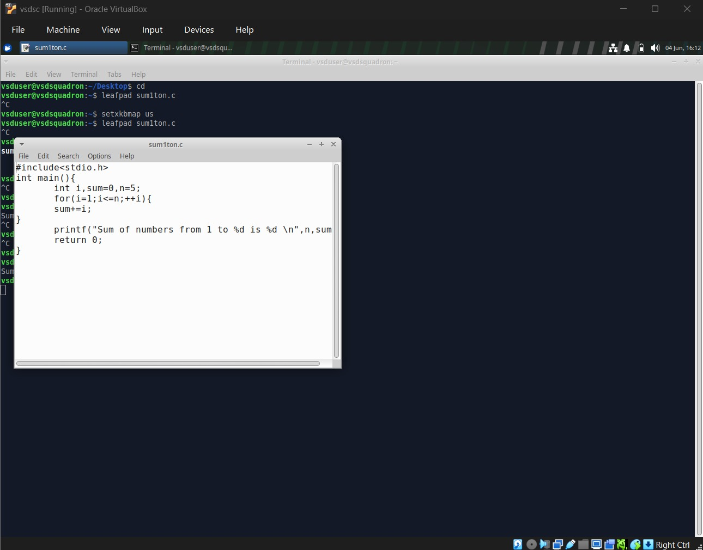

### Explanation

- Variable `sum` stores the cumulative result.
- Variable `i` acts as the loop counter.
- The loop iterates from 1 to `n`.
- During each iteration, the current value of `i` is added to `sum`.
- The final result is displayed using the `printf()` function.

---

# Step 2: Compilation and Execution using GCC

The source program was compiled and executed using the GNU GCC compiler.

## Commands Used

```bash
gcc sum1ton.c
./a.out
```

## Output

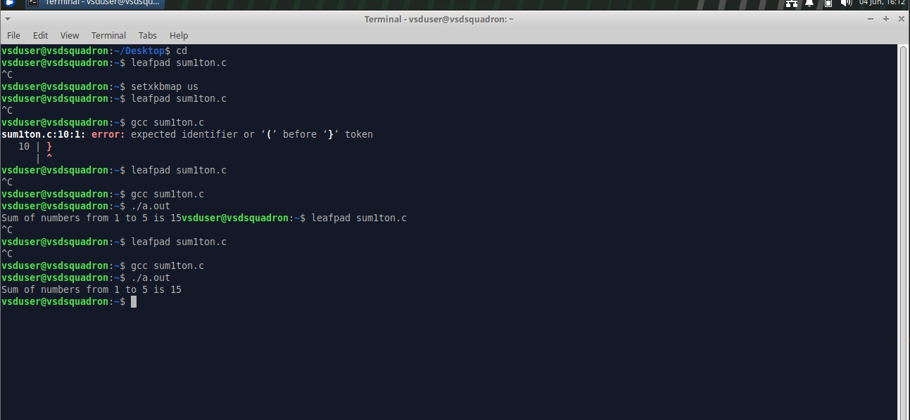

### Terminal Execution Verification

The following terminal snapshot confirms successful compilation and execution of the program for **n = 9**.

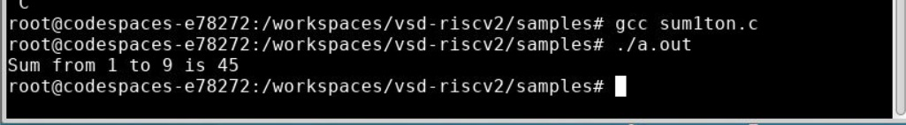

### Observation

For n = 9:

```text
1 + 2 + 3 + 4 + 5 + 6 + 7 + 8 + 9 = 45
```

The output confirms that the program logic is functioning correctly.

---

# Step 3: Program Modification and Verification

To further validate the implementation, the value of `n` was modified from **9** to **100**.

## Modified Source Code

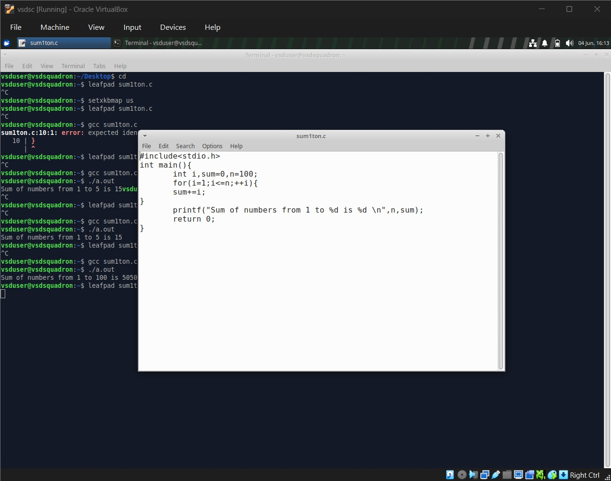

The source file was then displayed using the `cat` command for verification.

## Source File Verification

```bash
cat sum1ton.c
```

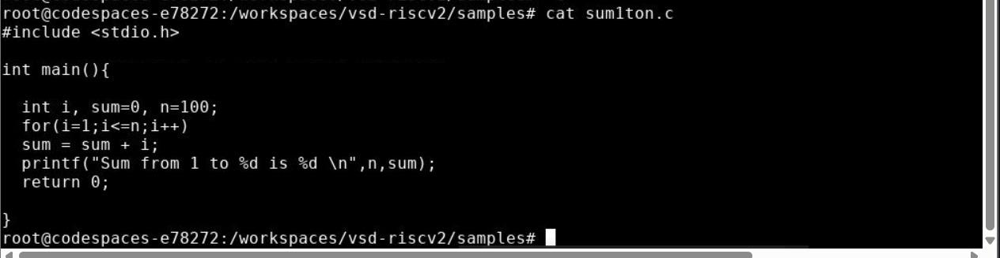

### Observation

The source listing confirms that the value of `n` was successfully updated to 100 before recompilation.

---

# Step 4: Recompilation and Execution

After modifying the value of `n`, the program was recompiled and executed.

## Commands Used

```bash
gcc sum1ton.c
./a.out
```

## Output

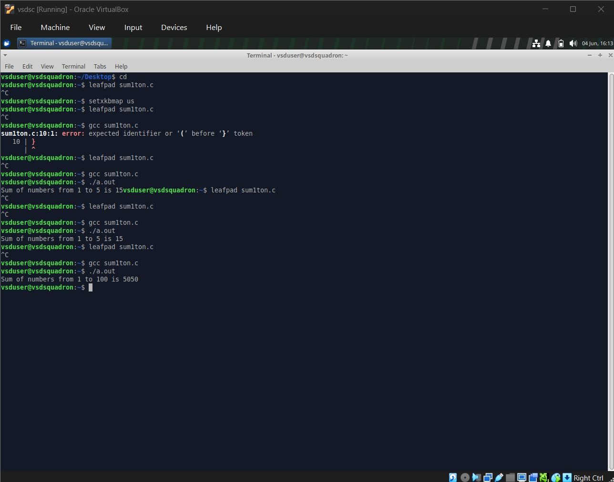

### Terminal Execution Verification

The following screenshot shows successful recompilation and execution after updating the value of `n` from 9 to 100.

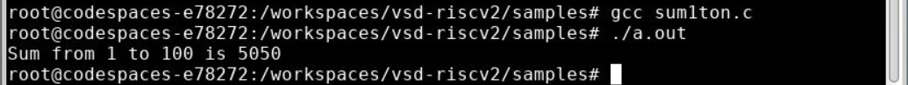

### Observation

For n = 100:

```text
100 × 101 / 2 = 5050
```

The obtained result matches the expected mathematical value.

---

# Step 5: Compilation Workflow

The following screenshot shows the complete workflow of program editing, compilation, and execution within the development environment.

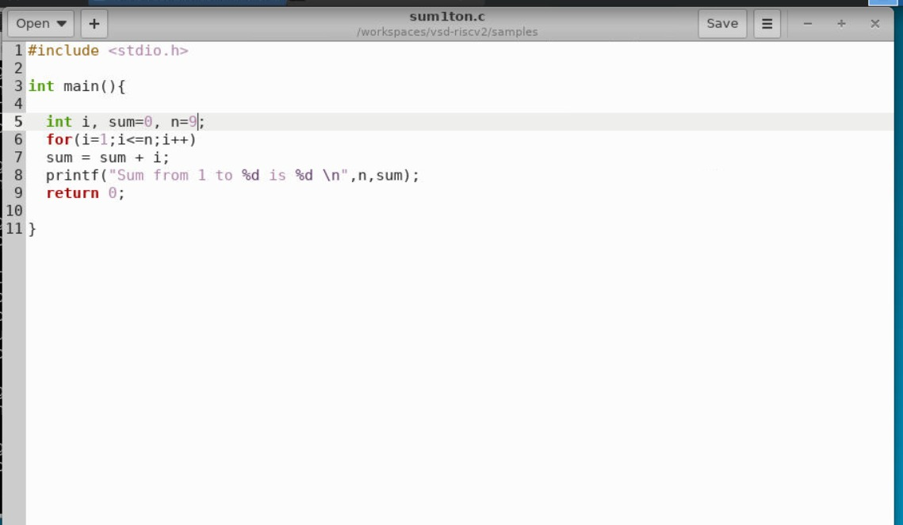

### Workflow Summary

1. Create or edit the source code.
2. Compile using GCC.
3. Execute the generated binary.
4. Verify the output.
5. Modify the source code when required.
6. Recompile and execute again.
7. Cross-compile for the RISC-V architecture.
8. Analyze generated machine instructions.

---

# Step 6: Cross Compilation using RISC-V GCC

After verifying the program using the native compiler, the next step was to generate machine code for the RISC-V architecture.

## Command

```bash
riscv64-unknown-elf-gcc -O1 -mabi=lp64 -march=rv64i -c sum1ton.c
```

## Parameter Description

| Option | Description |
|----------|----------|
| `-O1` | Enables basic compiler optimizations |
| `-mabi=lp64` | Uses LP64 ABI |
| `-march=rv64i` | Targets RV64I architecture |
| `-c` | Generates object file without linking |

The compilation process generates the object file:

```text
sum1ton.o
```

### Observation

Cross compilation allows code developed on the host machine to be translated into machine instructions for the RISC-V processor architecture.

---

# Step 7: Disassembling the Object File

The generated object file was analyzed using the RISC-V disassembler.

## Command

```bash
riscv64-unknown-elf-objdump -d sum1ton.o
```

## Disassembly Output

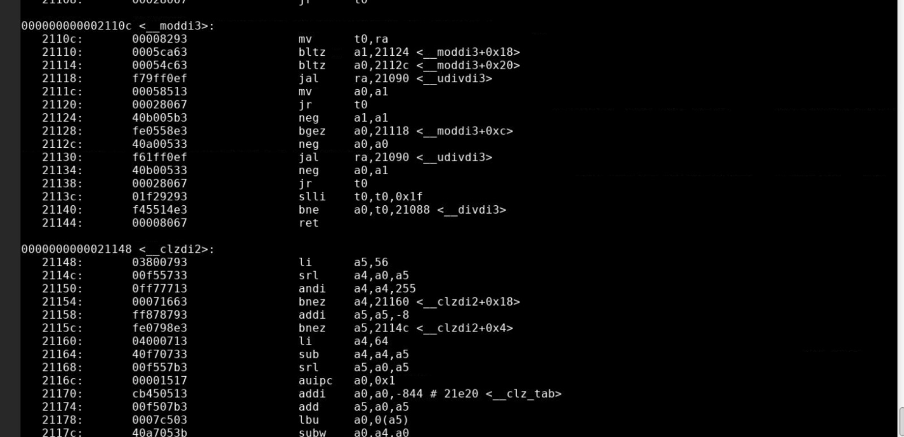

### Analysis

The disassembly output converts machine instructions into a human-readable assembly representation.

Important observations include:

- Function labels such as `<main>`
- Arithmetic instructions
- Memory access operations
- Stack pointer manipulation
- Function call instructions
- Return instructions

This provides a detailed view of how high-level C code is translated into RISC-V assembly language.

---

# Step 8: Analysis of O1 Optimization

The program was compiled using the **-O1** optimization level.

## Command

```bash
riscv64-unknown-elf-gcc -O1 -mabi=lp64 -march=rv64i -c sum1ton.c
```

## Main Function Generated with O1

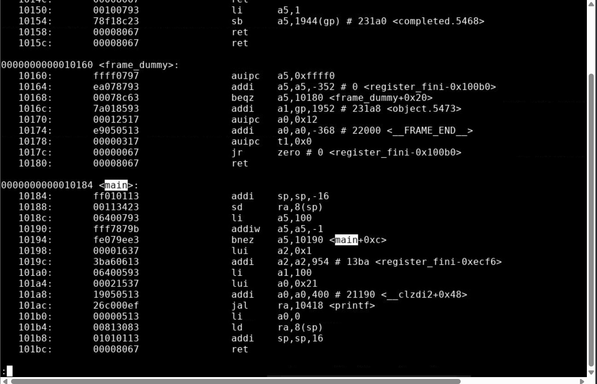

### What is O1 Optimization?

`-O1` performs basic compiler optimizations while maintaining a structure that closely resembles the original source code.

The optimizations include:

- Dead code elimination
- Constant propagation
- Simple instruction scheduling
- Basic loop optimization
- Removal of redundant operations

### Observation

The generated assembly still contains loop-related instructions that perform the summation operation during runtime.

**Key observations:**

- The loop structure is preserved.
- Branch instructions are present.
- Runtime calculations are performed inside the loop.
- Approximately 15 instructions are generated within the main routine.
- The generated code remains easy to correlate with the original C program.

This optimization level improves execution efficiency while preserving code readability and debugging capability.

---

# Step 9: Analysis of OFast Optimization

The same source code was compiled using the **-Ofast** optimization level.

## Command

```bash
riscv64-unknown-elf-gcc -Ofast -mabi=lp64 -march=rv64i -c sum1ton.c
```

## Main Function Generated with OFast

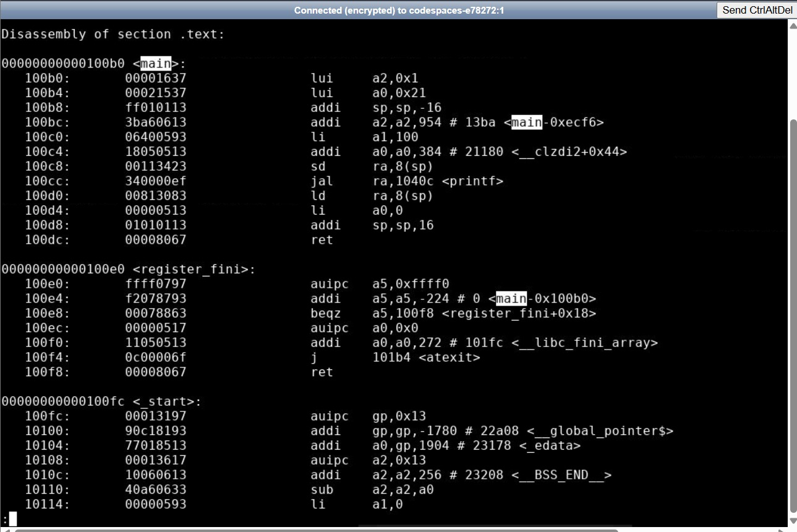

### What is OFast Optimization?

`-Ofast` enables all optimizations available in `-O3` along with additional aggressive optimizations that prioritize maximum execution speed.

The optimizations include:

- Constant folding
- Constant propagation
- Loop elimination
- Aggressive instruction scheduling
- Compile-time evaluation
- Advanced code simplification

### Observation

Unlike the assembly generated with **-O1**, the loop is no longer present in the generated machine code.

Since the value of `n` is known during compilation (`n = 100`), the compiler computes the final result at compile time and directly inserts the constant value into the assembly instructions.

**Key observations:**

- Loop instructions have been eliminated.
- Branch instructions related to iteration are removed.
- The final result is precomputed by the compiler.
- Approximately 12 instructions are generated.
- Fewer instructions are generated overall.
- Execution becomes faster due to reduced runtime computation.

In the OFast version, the compiler effectively transforms the original iterative computation into a simplified sequence of instructions that directly prepares the output for the `printf()` function.

---

# O1 vs OFast Comparison

| Feature | O1 | OFast |
|----------|----------|----------|
| Loop Structure | Preserved | Eliminated |
| Runtime Computation | Present | Reduced |
| Instruction Count | ~15 Instructions | ~12 Instructions |
| Code Readability | Easier to Understand | More Optimized |
| Execution Speed | Moderate | Faster |
| Compiler Aggressiveness | Basic | High |

The comparison clearly demonstrates how higher optimization levels can significantly reduce instruction count and improve execution efficiency by performing calculations during compilation rather than at runtime.

---

# Key Learning Outcomes

- Understood the workflow of native compilation using GCC.
- Learned the fundamentals of cross-compilation for the RISC-V architecture.
- Generated RISC-V object code from a high-level C program.
- Examined machine-level instructions using the `objdump` utility.
- Compared assembly output produced under different optimization levels.
- Analyzed the impact of compiler optimizations on instruction count and execution efficiency.
- Verified successful execution of RISC-V object code.
- Observed how compiler optimizations can transform iterative logic into highly optimized machine instructions.

---

# Conclusion

This task provided practical exposure to both native compilation and RISC-V cross-compilation workflows. The generated assembly code was analyzed using `objdump`, enabling a deeper understanding of how high-level C statements are translated into architecture-specific instructions.

Furthermore, comparison of **-O1** and **-Ofast** optimization levels demonstrated how compiler optimizations influence instruction generation, code size, and execution efficiency. Successful execution of the generated code validated the correctness of the compilation process and reinforced the concepts of compiler optimization, assembly analysis, and RISC-V program execution.

</details>

<details>
<summary><b>Task 2.1: RISC-V Program Simulation using SPIKE</b></summary>

## Objective

The objective of this task is to compile a C program, execute it using the SPIKE RISC-V simulator, and perform instruction-level debugging by examining register values and stack pointer behavior.

---

## 1. Compilation and Execution using GCC

The source file `sum1ton.c` was compiled using GCC and executed successfully. The output confirms the correctness of the program.

### Commands

```bash
gcc sum1ton.c
./a.out
```

### Output

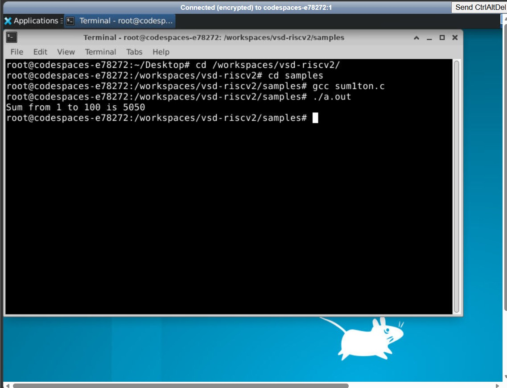
The program calculates the sum of integers from 1 to 100 and produces the expected result:

```text
Sum from 1 to 100 is 5050
```

---

## 2. Execution using SPIKE Simulator

The generated RISC-V executable was executed using the SPIKE simulator along with the proxy kernel (`pk`).

### Command

```bash
spike pk sum1ton.o
```

### Output


The output obtained through SPIKE matches the GCC execution result, confirming successful simulation.

---

## 3. Launching SPIKE in Debug Mode

To perform instruction-level analysis, SPIKE was launched in debug mode.

### Command

```bash
spike -d pk sum1ton.o
```

### Register Inspection

The value of register `a2` was inspected before execution of the target instruction.


At this stage, register `a2` contains:

```text
0x0000000000000000
```

---

## 4. Single-Step Instruction Execution

The debugger was used to execute instructions one step at a time, enabling detailed observation of program execution.


This approach helps in understanding how individual instructions modify processor state.

---

## 5. Effect of the LUI Instruction

The following instruction was executed:

```assembly
lui a2, 0x1
```

The value loaded into register `a2` was verified.


### Observation

```text
a2 = 0x0000000000001000
```

This demonstrates the operation of the Load Upper Immediate (LUI) instruction.

---

## 6. Verification of Register Updates

After subsequent instruction execution, the updated register values were examined.


### Observation

```text
a2 = 0x0000000000001000
a0 = 0x0000000000021000
```

The observed values confirm that the instructions correctly modified the destination registers.

---

## 7. Initial Stack Pointer Analysis

Before stack allocation, the value of the stack pointer (`sp`) was recorded.


### Initial Value

```text
sp = 0x000000007f7e9b50
```

---

## 8. Stack Pointer Modification using ADDI

The following instruction was executed:

```assembly
addi sp, sp, -16
```

This instruction allocates stack space by decrementing the stack pointer.


### Observation

Before execution:

```text
sp = 0x000000007f7e9b50
```

After execution:

```text
sp = 0x000000007f7e9b40
```

Difference:

```text
16 bytes
```

The result confirms successful stack frame allocation.

---

## Conclusion

This task demonstrated:

- Compilation and execution of a C program using GCC.
- Execution of a RISC-V binary using the SPIKE simulator.
- Instruction-level debugging using SPIKE debug mode.
- Inspection and verification of register contents.
- Analysis of the `LUI` instruction and its effect on registers.
- Observation of stack pointer updates during stack frame allocation.
- Understanding of processor state changes through single-step execution.

These experiments provided practical exposure to the RISC-V software toolchain, simulation environment, and debugging workflow.
</details>

<details>
<summary><b>Task 2.2: ATM SIMULATOR USING SPIKE AND GCC</b></summary>
  (WIP)
</details>
