# VSD_RISCV_INTERNSHIP

## DETAILS

**Titiksha Gupta**  
*B.Tech, Electronics & Communication Engineering*  
*The LNM Institute of Information Technology (LNMIIT), Jaipur*  

**Email:** titikshagupta164@gmail.com  
**Official Email:** 24dec023@lnmiit.ac.in  

**GitHub:** https://github.com/titikshagupta164-a11y  

**LinkedIn:** https://www.linkedin.com/in/titiksha-gupta-

---
<details>
<summary><b>Task 1: Compilation of a C Program using GCC and RISC-V GCC Compiler</b></summary>

# Objective

The objective of this task is to understand the complete workflow of compiling a C program using both the native GCC compiler and the RISC-V cross-compilation toolchain. The task also focuses on examining the generated assembly instructions and analyzing the impact of compiler optimization levels on the generated machine code.

---

# Step 1: Program Development

A simple C program was written to calculate the sum of natural numbers from **1 to n** using a loop.

Initially, the value of **n = 5** was used to verify the correctness of the program logic.

## Source Code

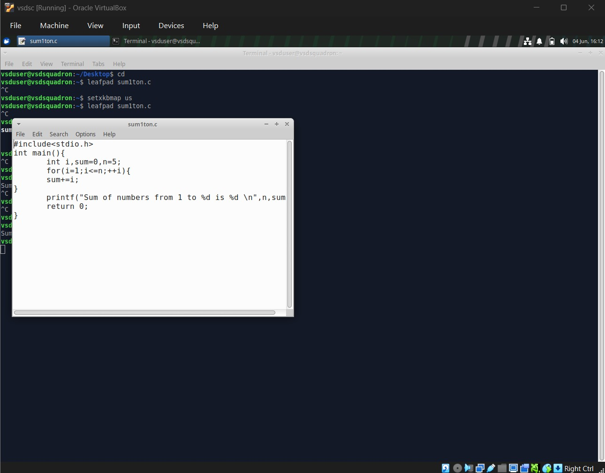

### Explanation

- Variable `sum` stores the cumulative result.
- Variable `i` acts as the loop counter.
- The loop iterates from 1 to `n`.
- During each iteration, the current value of `i` is added to `sum`.
- The final result is displayed using the `printf()` function.

---

# Step 2: Compilation and Execution using GCC

The source program was compiled and executed using the GNU GCC compiler.

## Commands Used

```bash
gcc sum1ton.c
./a.out
```

## Output

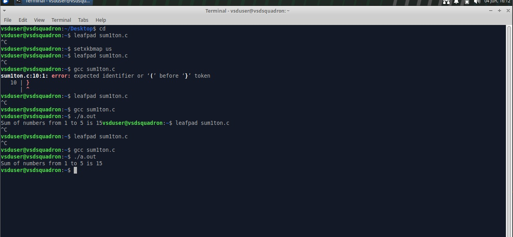

### Terminal Execution Verification

The following terminal snapshot confirms successful compilation and execution of the program for **n = 9**.

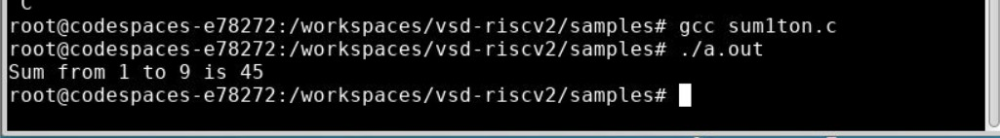

### Observation

For n = 9:

```text
1 + 2 + 3 + 4 + 5 + 6 + 7 + 8 + 9 = 45
```

The output confirms that the program logic is functioning correctly.

---

# Step 3: Program Modification and Verification

To further validate the implementation, the value of `n` was modified from **9** to **100**.

## Modified Source Code

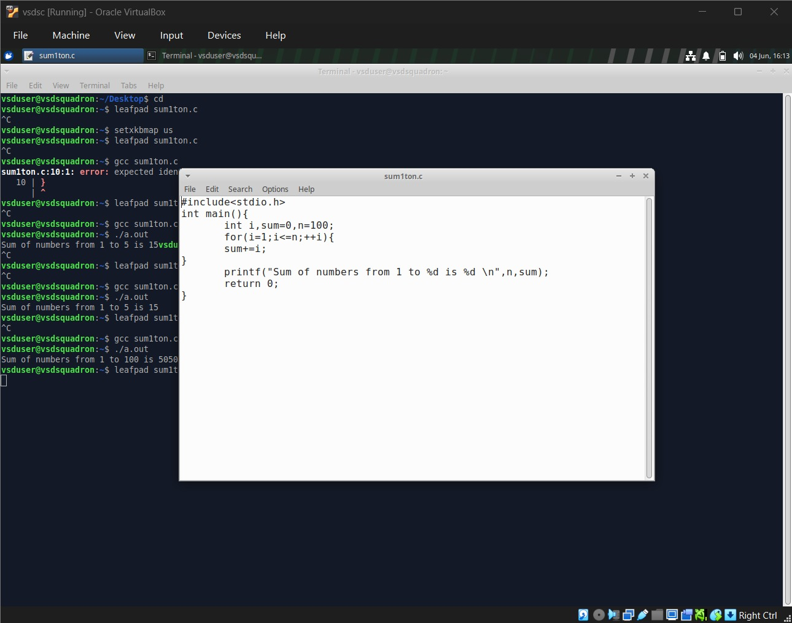

The source file was then displayed using the `cat` command for verification.

## Source File Verification

```bash
cat sum1ton.c
```

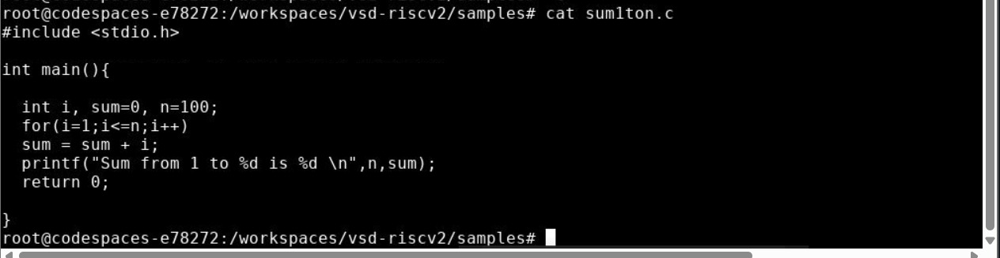

### Observation

The source listing confirms that the value of `n` was successfully updated to 100 before recompilation.

---

# Step 4: Recompilation and Execution

After modifying the value of `n`, the program was recompiled and executed.

## Commands Used

```bash
gcc sum1ton.c
./a.out
```

## Output

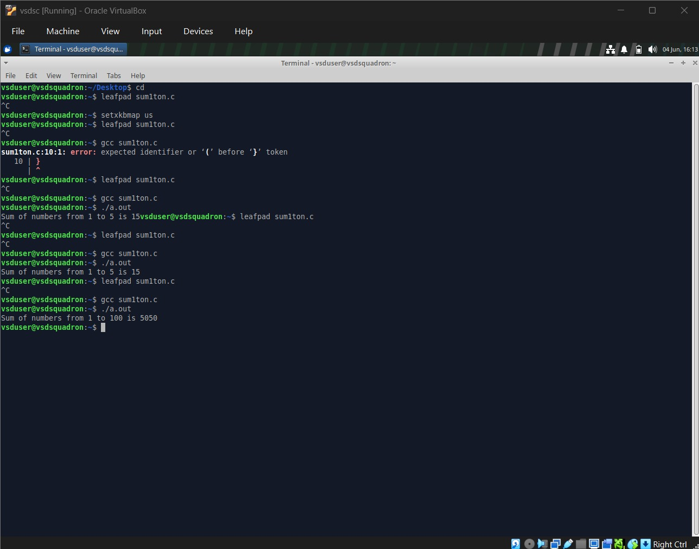

### Terminal Execution Verification

The following screenshot shows successful recompilation and execution after updating the value of `n` from 9 to 100.

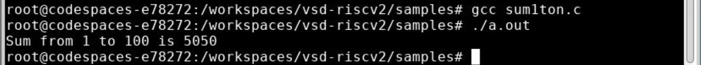

### Observation

For n = 100:

```text
100 × 101 / 2 = 5050
```

The obtained result matches the expected mathematical value.

---

# Step 5: Compilation Workflow

The following screenshot shows the complete workflow of program editing, compilation, and execution within the development environment.

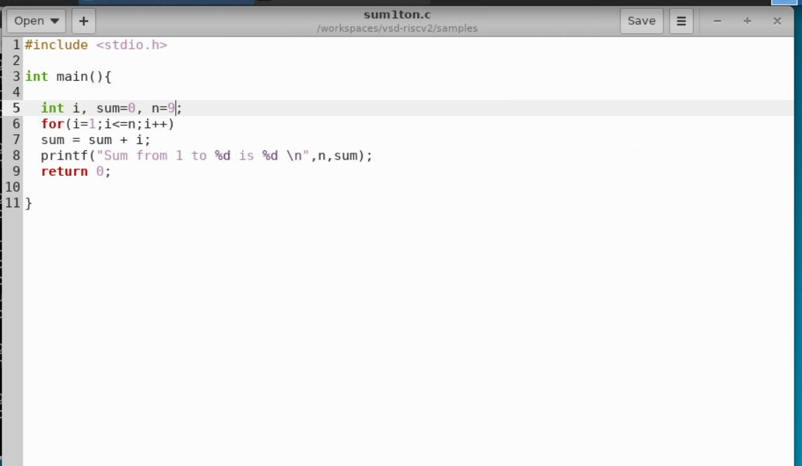

### Workflow Summary

1. Create or edit the source code.
2. Compile using GCC.
3. Execute the generated binary.
4. Verify the output.
5. Modify the source code when required.
6. Recompile and execute again.
7. Cross-compile for the RISC-V architecture.
8. Analyze generated machine instructions.

---

# Step 6: Cross Compilation using RISC-V GCC

After verifying the program using the native compiler, the next step was to generate machine code for the RISC-V architecture.

## Command

```bash
riscv64-unknown-elf-gcc -O1 -mabi=lp64 -march=rv64i -c sum1ton.c
```

## Parameter Description

| Option | Description |
|----------|----------|
| `-O1` | Enables basic compiler optimizations |
| `-mabi=lp64` | Uses LP64 ABI |
| `-march=rv64i` | Targets RV64I architecture |
| `-c` | Generates object file without linking |

The compilation process generates the object file:

```text
sum1ton.o
```

### Observation

Cross compilation allows code developed on the host machine to be translated into machine instructions for the RISC-V processor architecture.

---

# Step 7: Disassembling the Object File

The generated object file was analyzed using the RISC-V disassembler.

## Command

```bash
riscv64-unknown-elf-objdump -d sum1ton.o
```

## Disassembly Output

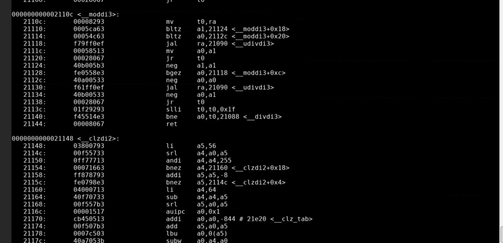

### Analysis

The disassembly output converts machine instructions into a human-readable assembly representation.

Important observations include:

- Function labels such as `<main>`
- Arithmetic instructions
- Memory access operations
- Stack pointer manipulation
- Function call instructions
- Return instructions

This provides a detailed view of how high-level C code is translated into RISC-V assembly language.

---

# Step 8: Analysis of O1 Optimization

The program was compiled using the **-O1** optimization level.

## Command

```bash
riscv64-unknown-elf-gcc -O1 -mabi=lp64 -march=rv64i -c sum1ton.c
```

## Main Function Generated with O1

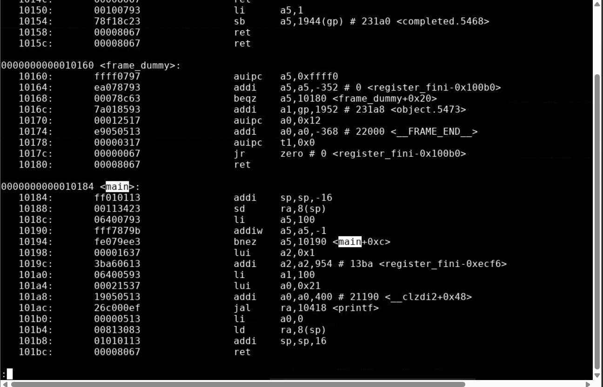

### What is O1 Optimization?

`-O1` performs basic compiler optimizations while maintaining a structure that closely resembles the original source code.

The optimizations include:

- Dead code elimination
- Constant propagation
- Simple instruction scheduling
- Basic loop optimization
- Removal of redundant operations

### Observation

The generated assembly still contains loop-related instructions that perform the summation operation during runtime.

**Key observations:**

- The loop structure is preserved.
- Branch instructions are present.
- Runtime calculations are performed inside the loop.
- Approximately 15 instructions are generated within the main routine.
- The generated code remains easy to correlate with the original C program.

This optimization level improves execution efficiency while preserving code readability and debugging capability.

---

# Step 9: Analysis of OFast Optimization

The same source code was compiled using the **-Ofast** optimization level.

## Command

```bash
riscv64-unknown-elf-gcc -Ofast -mabi=lp64 -march=rv64i -c sum1ton.c
```

## Main Function Generated with OFast

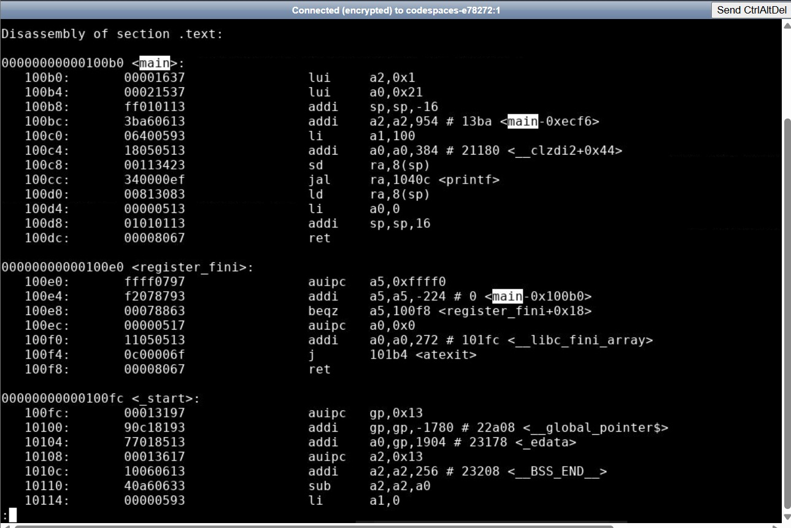

### What is OFast Optimization?

`-Ofast` enables all optimizations available in `-O3` along with additional aggressive optimizations that prioritize maximum execution speed.

The optimizations include:

- Constant folding
- Constant propagation
- Loop elimination
- Aggressive instruction scheduling
- Compile-time evaluation
- Advanced code simplification

### Observation

Unlike the assembly generated with **-O1**, the loop is no longer present in the generated machine code.

Since the value of `n` is known during compilation (`n = 100`), the compiler computes the final result at compile time and directly inserts the constant value into the assembly instructions.

**Key observations:**

- Loop instructions have been eliminated.
- Branch instructions related to iteration are removed.
- The final result is precomputed by the compiler.
- Approximately 12 instructions are generated.
- Fewer instructions are generated overall.
- Execution becomes faster due to reduced runtime computation.

In the OFast version, the compiler effectively transforms the original iterative computation into a simplified sequence of instructions that directly prepares the output for the `printf()` function.

---

# O1 vs OFast Comparison

| Feature | O1 | OFast |
|----------|----------|----------|
| Loop Structure | Preserved | Eliminated |
| Runtime Computation | Present | Reduced |
| Instruction Count | ~15 Instructions | ~12 Instructions |
| Code Readability | Easier to Understand | More Optimized |
| Execution Speed | Moderate | Faster |
| Compiler Aggressiveness | Basic | High |

The comparison clearly demonstrates how higher optimization levels can significantly reduce instruction count and improve execution efficiency by performing calculations during compilation rather than at runtime.

---

# Key Learning Outcomes

- Understood the workflow of native compilation using GCC.
- Learned the fundamentals of cross-compilation for the RISC-V architecture.
- Generated RISC-V object code from a high-level C program.
- Examined machine-level instructions using the `objdump` utility.
- Compared assembly output produced under different optimization levels.
- Analyzed the impact of compiler optimizations on instruction count and execution efficiency.
- Verified successful execution of RISC-V object code.
- Observed how compiler optimizations can transform iterative logic into highly optimized machine instructions.

---

# Conclusion

This task provided practical exposure to both native compilation and RISC-V cross-compilation workflows. The generated assembly code was analyzed using `objdump`, enabling a deeper understanding of how high-level C statements are translated into architecture-specific instructions.

Furthermore, comparison of **-O1** and **-Ofast** optimization levels demonstrated how compiler optimizations influence instruction generation, code size, and execution efficiency. Successful execution of the generated code validated the correctness of the compilation process and reinforced the concepts of compiler optimization, assembly analysis, and RISC-V program execution.

</details>

<details>
<summary><b>Task 2.1: RISC-V Program Simulation using SPIKE</b></summary>

## Objective

The objective of this task is to compile a C program, execute it using the SPIKE RISC-V simulator, and perform instruction-level debugging by examining register values and stack pointer behavior.

---

## 1. Compilation and Execution using GCC

The source file `sum1ton.c` was compiled using GCC and executed successfully. The output confirms the correctness of the program.

### Commands

```bash
gcc sum1ton.c
./a.out
```

### Output

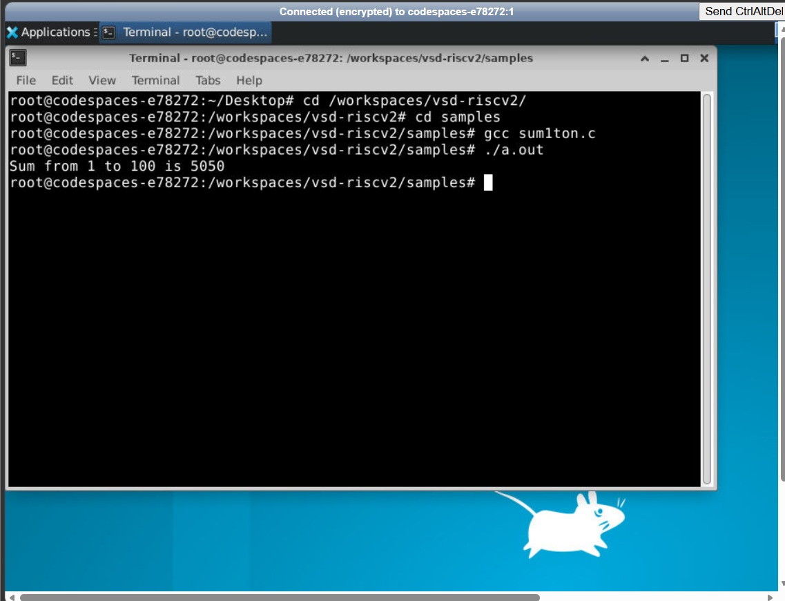
The program calculates the sum of integers from 1 to 100 and produces the expected result:

```text
Sum from 1 to 100 is 5050
```

---

## 2. Execution using SPIKE Simulator

The generated RISC-V executable was executed using the SPIKE simulator along with the proxy kernel (`pk`).

### Command

```bash
spike pk sum1ton.o
```

### Output


The output obtained through SPIKE matches the GCC execution result, confirming successful simulation.

---

## 3. Launching SPIKE in Debug Mode

To perform instruction-level analysis, SPIKE was launched in debug mode.

### Command

```bash
spike -d pk sum1ton.o
```

### Register Inspection

The value of register `a2` was inspected before execution of the target instruction.


At this stage, register `a2` contains:

```text
0x0000000000000000
```

---

## 4. Single-Step Instruction Execution

The debugger was used to execute instructions one step at a time, enabling detailed observation of program execution.


This approach helps in understanding how individual instructions modify processor state.

---

## 5. Effect of the LUI Instruction

The following instruction was executed:

```assembly
lui a2, 0x1
```

The value loaded into register `a2` was verified.


### Observation

```text
a2 = 0x0000000000001000
```

This demonstrates the operation of the Load Upper Immediate (LUI) instruction.

---

## 6. Verification of Register Updates

After subsequent instruction execution, the updated register values were examined.


### Observation

```text
a2 = 0x0000000000001000
a0 = 0x0000000000021000
```

The observed values confirm that the instructions correctly modified the destination registers.

---

## 7. Initial Stack Pointer Analysis

Before stack allocation, the value of the stack pointer (`sp`) was recorded.


### Initial Value

```text
sp = 0x000000007f7e9b50
```

---

## 8. Stack Pointer Modification using ADDI

The following instruction was executed:

```assembly
addi sp, sp, -16
```

This instruction allocates stack space by decrementing the stack pointer.


### Observation

Before execution:

```text
sp = 0x000000007f7e9b50
```

After execution:

```text
sp = 0x000000007f7e9b40
```

Difference:

```text
16 bytes
```

The result confirms successful stack frame allocation.

---

## Conclusion

This task demonstrated:

- Compilation and execution of a C program using GCC.
- Execution of a RISC-V binary using the SPIKE simulator.
- Instruction-level debugging using SPIKE debug mode.
- Inspection and verification of register contents.
- Analysis of the `LUI` instruction and its effect on registers.
- Observation of stack pointer updates during stack frame allocation.
- Understanding of processor state changes through single-step execution.

These experiments provided practical exposure to the RISC-V software toolchain, simulation environment, and debugging workflow.
</details>

<details>
<summary><b>Task 2.2: ATM SIMULATOR USING SPIKE AND GCC</b></summary>

# ATM Transaction Simulator using RISC-V GCC and SPIKE

## Project Overview

This project implements an ATM Transaction Simulator in C and demonstrates its execution on the RISC-V architecture using the RISC-V GCC Toolchain and SPIKE Simulator.

The simulator supports the following operations:

* Check Balance
* Deposit Money
* Withdraw Money
* Exit Application

The project was compiled and analyzed using two optimization levels:

* `-O1`
* `-Ofast`

The generated assembly code was examined using Objdump, and instruction counts were calculated for comparison.

---

# Tools Used

| Tool          | Purpose                   |
| ------------- | ------------------------- |
| C Programming | ATM Simulator Development |
| GCC           | Native Compilation        |
| RISC-V GCC    | Cross Compilation         |
| SPIKE         | RISC-V ISA Simulation     |
| Objdump       | Assembly Analysis         |
| GitHub        | Documentation             |

---

# Source Code

The ATM Simulator is implemented in C using a menu-driven approach that allows users to perform basic banking transactions.

---

# Native GCC Compilation

## Compile

```bash
gcc atm_simulator.c
```

## Run

```bash
./a.out
```

---

# Program Execution

## Check Balance

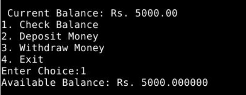

---

## Deposit Money

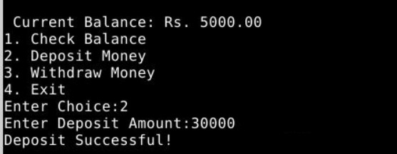

---

## Withdraw Money

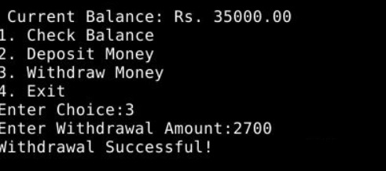

---

## Exit Application

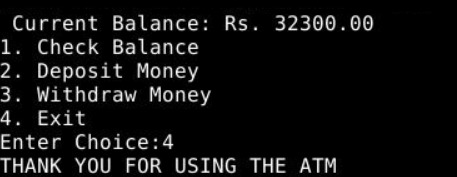

---

# RISC-V Cross Compilation (-O1)

## Compilation Command

```bash
riscv64-unknown-elf-gcc -O1 -mabi=lp64 -march=rv64i -o atm_simulator.o atm_simulator.c
```

## Object File Generation

```bash
ls -ltr atm_simulator.o
```

### Output

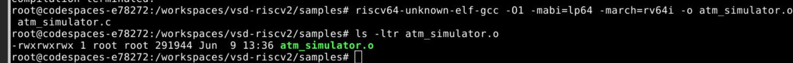

---

# SPIKE Simulation

## Execute on SPIKE

```bash
spike pk atm_simulator.o
```

### Initial SPIKE Execution

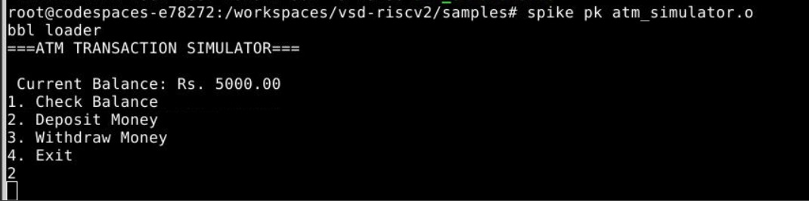

### Complete ATM Transaction Execution

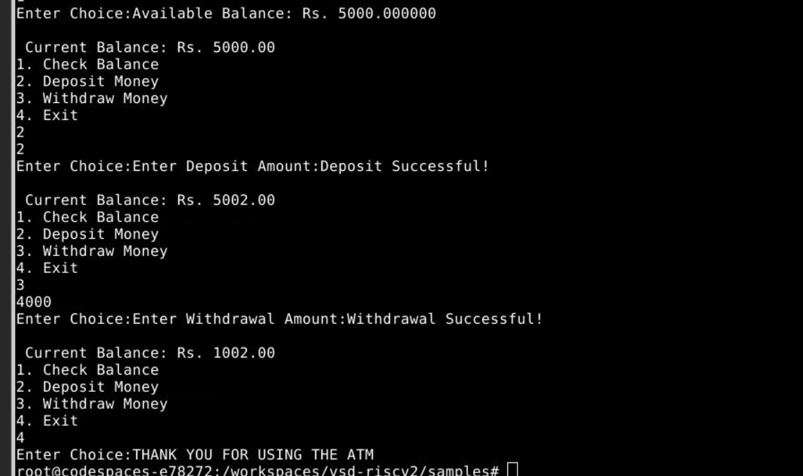

---

# Objdump Analysis (-O1)

## Generate Assembly

```bash
riscv64-unknown-elf-objdump -d atm_simulator.o | less
```

### Main Function Assembly

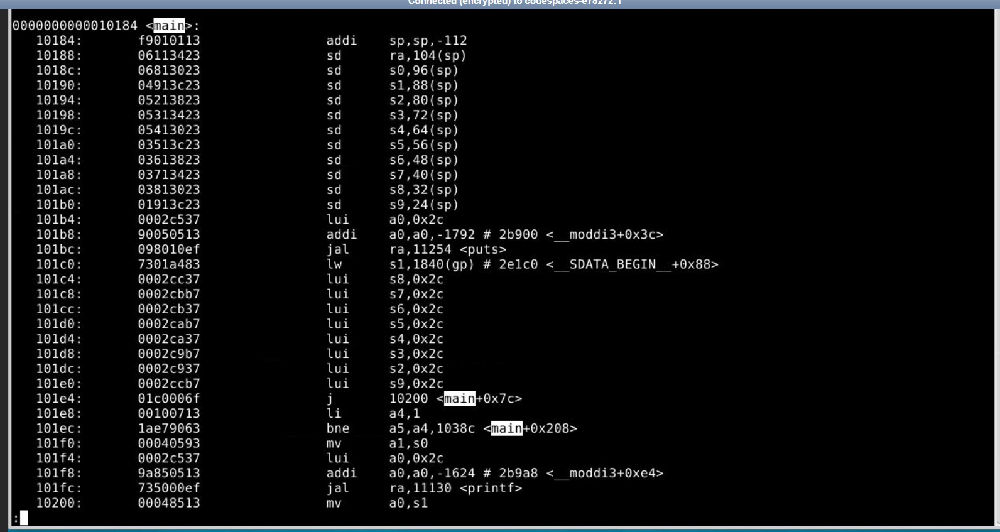

---

## Instruction Count Calculation (-O1)

### Main Function Address Information

| Parameter     | Address |
| ------------- | ------- |
| Start Address | 0x10184 |
| End Address   | 0x1039C |

### Calculation

```text
Number of Instructions
= (0x1039C - 0x10184) / 4

= 0x218 / 4

= 536 / 4

= 134 Instructions
```

### Result

| Optimization | Instruction Count |
| ------------ | ----------------- |
| -O1          | 134               |

---

# SPIKE Debug Mode (-O1)

## Command

```bash
spike -d pk atm_simulator.o
```

### Commands Used

```bash
until pc 0 10184
reg 0 sp
```

### Debug Output

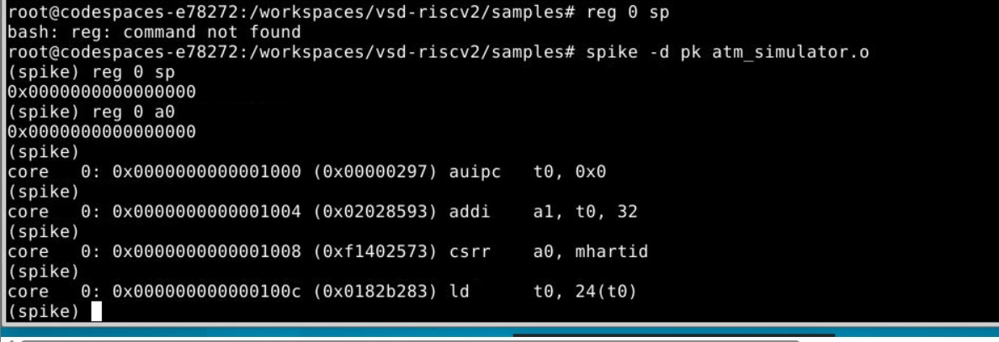

---

# RISC-V Cross Compilation (-Ofast)

## Compilation Command

```bash
riscv64-unknown-elf-gcc -Ofast -mabi=lp64 -march=rv64i -o atm_simulator_fast.o atm_simulator.c
```

---

# Objdump Analysis (-Ofast)

## Generate Assembly

```bash
riscv64-unknown-elf-objdump -d atm_simulator_fast.o | less
```

### Main Function Assembly

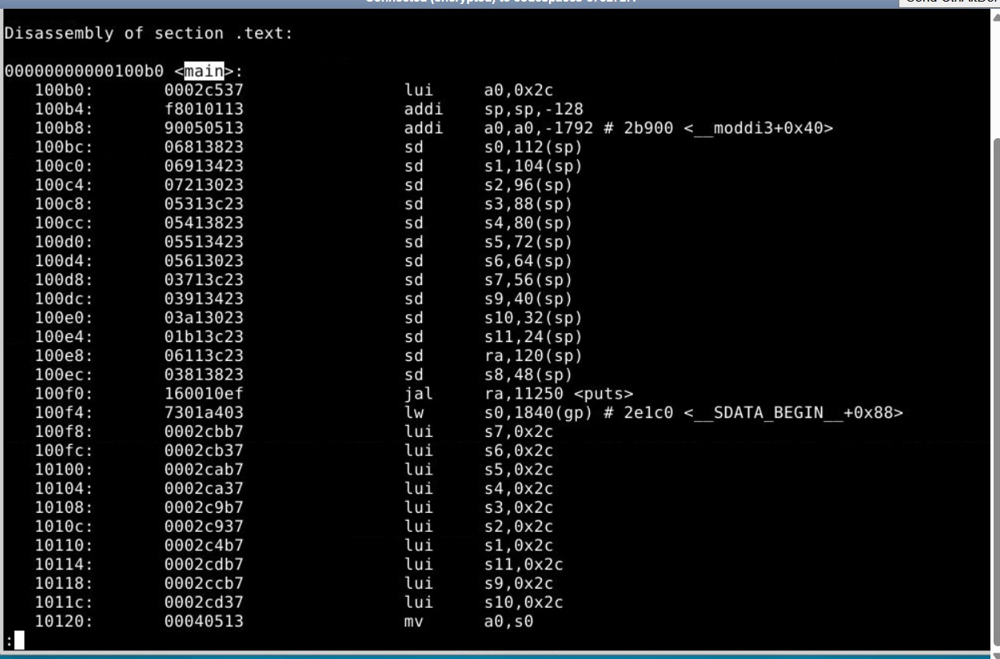

---

## Instruction Count Calculation (-Ofast)

### Main Function Address Information

| Parameter     | Address |
| ------------- | ------- |
| Start Address | 0x100B0 |
| End Address   | 0x102C4 |

### Calculation

```text
Number of Instructions
= (0x102C4 - 0x100B0) / 4

= 0x214 / 4

= 532 / 4

= 133 Instructions
```

### Result

| Optimization | Instruction Count |
| ------------ | ----------------- |
| -Ofast       | 133               |

---

# SPIKE Debug Mode (-Ofast)

## Command

```bash
spike -d pk atm_simulator_fast.o
```

### Commands Used

```bash
until pc 0 100b0
reg 0 sp
```

### Debug Output

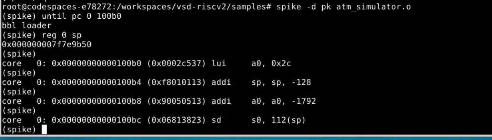

---

# Optimization Comparison

| Parameter          | -O1     | -Ofast  |
| ------------------ | ------- | ------- |
| Main Start Address | 0x10184 | 0x100B0 |
| Main End Address   | 0x1039C | 0x102C4 |
| Instruction Count  | 134     | 133     |

---

# Observations

* The ATM Simulator was successfully compiled using both `-O1` and `-Ofast` optimization levels.
* The generated RISC-V object files executed correctly on the SPIKE simulator.
* Objdump analysis was used to inspect the generated assembly instructions.
* The instruction count for the `main()` function was calculated manually from the assembly output.
* `-Ofast` generated slightly fewer instructions compared to `-O1`, indicating a more aggressive optimization strategy.
* SPIKE debug mode enabled instruction-level execution and register inspection.

---

# Conclusion

The ATM Transaction Simulator was successfully implemented in C and executed on the RISC-V architecture using SPIKE.

This project demonstrates:

* Native C program execution
* Cross-compilation using RISC-V GCC
* Simulation using SPIKE
* Assembly code analysis using Objdump
* Instruction count comparison across optimization levels
* Instruction-level debugging using SPIKE Debug Mode

The results confirm correct functionality of the ATM Simulator and provide insight into the effects of compiler optimizations on generated RISC-V assembly code.
</details>

<details>
<summary><b>Task 3: Environment Setup & RISC-V Reference Bring-Up</b></summary>

## Objective

The objective of this task was to establish a complete RISC-V development environment, validate the functionality of the provided reference design, execute the VSD FPGA laboratory exercises, and prepare a local development setup for future FPGA and IP integration tasks.

The task focused on:

* Toolchain verification and readiness
* Understanding the RISC-V software execution flow
* Running a working RISC-V reference program
* Executing VSDFPGA laboratory examples
* Preparing a local Linux-based development environment
* Understanding the integration of future FPGA IP blocks

---

# Development Environment

## Cloud Environment

* GitHub Codespaces
* Pre-configured VSD RISC-V development container
* RISC-V GCC Toolchain
* Spike RISC-V ISA Simulator
* Icarus Verilog

## Local Environment

* Oracle VirtualBox
* Ubuntu Linux Virtual Machine
* Local repository setup for future FPGA development

---

# Step 1: GitHub Codespaces Setup

The official `vsd-riscv2` repository was forked and launched using GitHub Codespaces.

The environment was verified successfully using:

```bash
riscv64-unknown-elf-gcc --version
spike --version
iverilog -V
```

This confirmed that the required RISC-V software toolchain and simulation tools were correctly installed and accessible.

---

# Step 2: RISC-V Reference Program Execution

The reference RISC-V program available in the `samples` directory was compiled using the RISC-V cross-compiler and executed using the Spike simulator.

## Compilation Command

```bash
riscv64-unknown-elf-gcc -o sum1ton.o sum1ton.c
```

## Execution Command

```bash
spike pk sum1ton.o
```

## Program Source

```c
#include <stdio.h>

int main()
{
    int i, sum=0, n=100;

    for(i=1;i<=n;i++)
        sum += i;

    printf("Sum from 1 to %d is %d\n", n, sum);

    return 0;
}
```

## Expected Output

```text
Sum from 1 to 100 is 5050
```

## Observed Output

```text
Sum from 1 to 100 is 5050
```

### Execution Snapshot

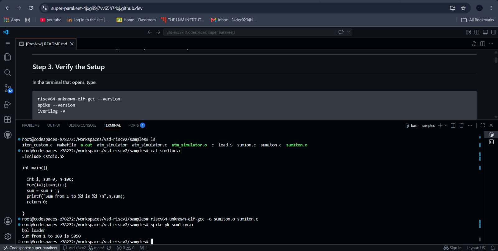

---

# Step 3: VSDFPGA Laboratory Execution

After validating the RISC-V reference flow, the FPGA laboratory repository was executed within the same Codespaces environment.

The firmware example was compiled and simulated successfully.

## Firmware Build Process

* Firmware source verification
* Hex file generation
* RISC-V compilation
* Simulation using Spike

## Observed Output

```text
LEARN TO THINK LIKE A CHIP
VSDSQUADRON FPGA MINI
BRINGS RISC-V TO VSD CLASSROOM
```

### Firmware Execution Snapshot

!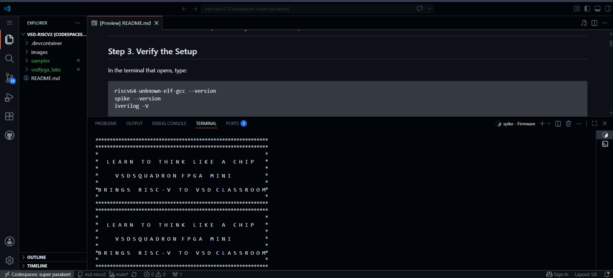

---

# Step 4: Local Machine Preparation

To prepare for future FPGA development activities, the repositories were cloned on a local Ubuntu virtual machine.

## Workspace Creation

```bash
mkdir ~/riscv_fpga_ip
cd ~/riscv_fpga_ip
```

## Repository Cloning

```bash
git clone https://github.com/vsdip/vsd-riscv2.git

git clone https://github.com/vsdip/vsdfpga_labs.git
```

## Verification

```bash
ls
```

Output:

```text
vsd-riscv2
vsdfpga_labs
```

### Local Setup Snapshot

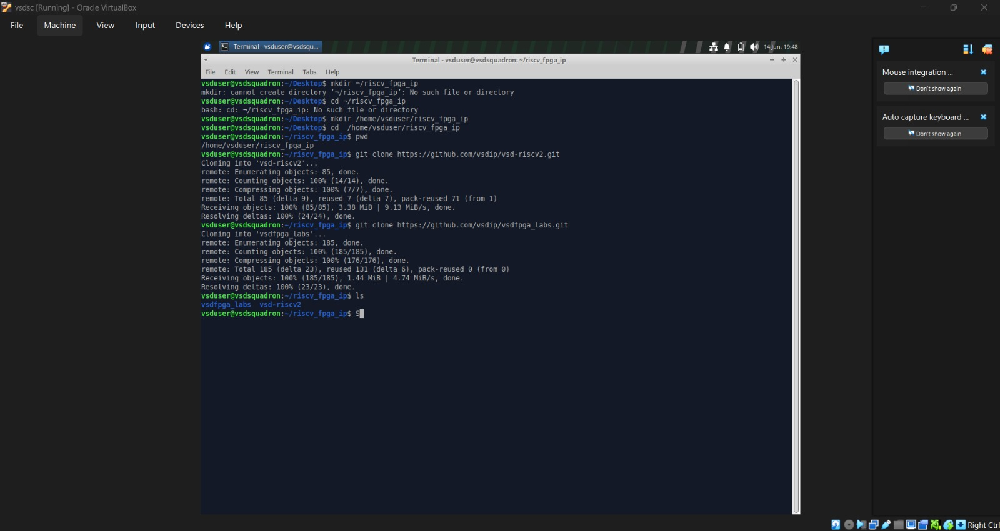

---

# Understanding Questions

## Q1. Where is the RISC-V reference program located?

The RISC-V reference program is located in the `samples` directory of the `vsd-riscv2` repository. This directory contains example programs used to verify the RISC-V toolchain and simulation flow.

---

## Q2. How is the program compiled and loaded into memory?

The source file is compiled using the RISC-V cross-compiler (`riscv64-unknown-elf-gcc`) which generates a RISC-V executable binary.

The executable is then executed using the Spike simulator through:

```bash
spike pk <program>
```

The Proxy Kernel (`pk`) loads the executable into simulated memory and manages execution.

---

## Q3. How does the RISC-V core access memory and memory-mapped I/O?

The RISC-V processor accesses memory using standard load and store instructions.

Memory-mapped peripherals are assigned dedicated address ranges within the system memory map. The processor communicates with these peripherals by reading from and writing to the corresponding addresses.

---

## Q4. Where would a new FPGA IP block logically integrate within the system?

A new FPGA IP block would typically be integrated as a memory-mapped peripheral connected to the SoC interconnect.

This allows the RISC-V processor to access the IP block through standard memory transactions without requiring special instructions.

---

# Key Learning Outcomes

Through this task, the following concepts were understood and validated:

* RISC-V software compilation flow
* Cross-compilation using the RISC-V GCC toolchain
* Program execution using the Spike simulator
* Firmware build and simulation process
* Repository management in GitHub Codespaces
* Local Linux development environment preparation
* Memory-mapped peripheral architecture
* Foundation concepts for future FPGA and SoC integration tasks

---

# Conclusion

The development environment was successfully configured and validated. The reference RISC-V application executed correctly, the VSDFPGA laboratory exercises were completed successfully, and a local Ubuntu-based development environment was prepared.

This task established a strong foundation for upcoming RTL design, FPGA integration, and custom IP development activities in the VSD RISC-V Internship program.

</details>
<details>
<summary><b>Task 4: Design & Integrate Your First Memory-Mapped IP </b></summary>

## Objective

The objective of this task was to understand the existing RISC-V System-on-Chip (SoC) architecture, design a custom General Purpose Input Output (GPIO) peripheral, integrate it into the memory-mapped I/O framework of the SoC, and validate its operation through simulation.

This task involved studying the existing peripheral interface, creating a standalone GPIO RTL module, connecting it to the processor bus, writing firmware to access the GPIO register, and verifying the complete functionality using simulation and waveform analysis.

---

# Step 1: Understanding the Existing SoC

Before implementing the GPIO peripheral, the architecture of the provided RISC-V SoC was analyzed.

The SoC follows a memory-mapped I/O approach, where peripherals are assigned specific address locations within the processor address space. The processor communicates with peripherals using standard memory read and write operations.

The following observations were made during the analysis:

- The processor generates memory addresses through the `mem_addr` bus.
- Read and write operations are controlled through `mem_rstrb` and `mem_wmask`.
- Existing peripherals such as LEDs and UART are already connected through the memory-mapped I/O interface.
- Peripheral selection is performed using address decoding logic based on `mem_wordaddr`.
- Data from peripherals is returned to the processor through the `mem_rdata` bus.

## Project Structure

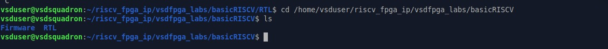

### GPIO Address Decode Identification

The existing address decoding mechanism was studied to determine how a new peripheral could be integrated into the SoC.

A dedicated decode bit was assigned for the GPIO peripheral:

```verilog
localparam IO_GPIO_bit = 3;
```

This decode bit is used to identify accesses directed toward the GPIO peripheral.

### Screenshot

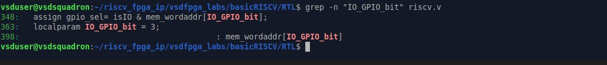

---

# Step 2: GPIO RTL Design

A custom RTL module named `gpio_output.v` was developed to implement the GPIO peripheral.

The module contains:

- A 32-bit register for storing GPIO data.
- Synchronous write logic triggered on the rising edge of the clock.
- Reset functionality for initialization.
- Readback support allowing software to retrieve stored values.
- Continuous output assignment to expose the register contents.

## GPIO RTL Implementation

```verilog
module gpio_output(
    input clk,
    input resetn,
    input gpio_sel,
    input gpio_we,
    input [31:0] gpio_wdata,
    output reg [31:0] gpio_rdata,
    output [31:0] gpio_out
);
```

### Working Principle

#### Reset Operation

Whenever the active-low reset signal is asserted, the GPIO register is cleared.

```verilog
if(!resetn)
    gpio_reg <= 32'd0;
```

#### Write Operation

When both the GPIO select signal and write enable signal are active, the incoming write data is stored inside the GPIO register.

```verilog
if(gpio_sel && gpio_we)
    gpio_reg <= gpio_wdata;
```

#### Read Operation

When the GPIO peripheral is selected, the stored register value is placed on the read data bus.

```verilog
gpio_rdata = gpio_reg;
```

#### Output Operation

The GPIO output always reflects the current value stored in the GPIO register.

```verilog
assign gpio_out = gpio_reg;
```

### RTL Screenshot

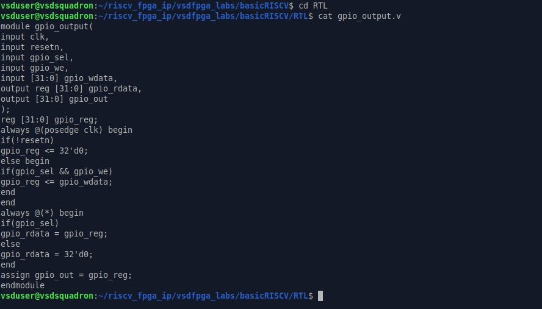

---

# Step 3: GPIO Integration into the SoC

After creating the GPIO RTL module, it was integrated into the SoC top level.

The integration process consisted of address decoding, module instantiation, bus connection, and readback integration.

## GPIO Address Decoding

The processor accesses peripherals through memory-mapped addresses.

The GPIO select signal was generated using:

```verilog
assign gpio_sel = isIO & mem_wordaddr[IO_GPIO_bit];
```

### Explanation

- `isIO` indicates that the processor is accessing the I/O region.
- `mem_wordaddr` contains the decoded word address.
- `IO_GPIO_bit` uniquely identifies the GPIO peripheral.
- When this bit becomes active, the GPIO peripheral is selected.

### Screenshot


---

## GPIO Module Instantiation

The GPIO module was instantiated inside the SoC and connected to the processor bus signals.

```verilog
gpio_output custom_gpio_inst(
    .clk(clk),
    .resetn(resetn),
    .gpio_sel(gpio_sel),
    .gpio_we(mem_wstrb),
    .gpio_wdata(mem_wdata),
    .gpio_rdata(gpio_rdata),
    .gpio_out(GPIO_OUT)
);
```

### Explanation

The connections perform the following functions:

| Signal | Purpose |
|----------|----------|
| clk | System clock |
| resetn | Active-low reset |
| gpio_sel | Peripheral selection |
| mem_wstrb | Write enable |
| mem_wdata | Data from CPU |
| gpio_rdata | Read data to CPU |
| GPIO_OUT | GPIO output |

### Screenshot

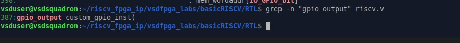

---

## GPIO Readback Integration

To allow software to read the GPIO register, the GPIO read data was added to the SoC readback multiplexer.

```verilog
: gpio_rdata
```

### Explanation

When the processor performs a read operation targeting the GPIO address, the stored GPIO register value is returned through the `mem_rdata` bus.

### Screenshot

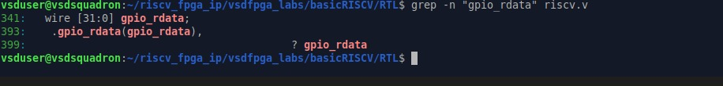

---

# Step 4: Firmware Development and Simulation

To validate the GPIO peripheral, a simple firmware application was developed.

The firmware writes multiple test values into the GPIO register.

## Firmware Source Code

```c
#define GPIO_ADDR 0x00400020

volatile unsigned int *gpio =
    (volatile unsigned int *)GPIO_ADDR;

void main()
{
    *gpio = 0xABCDEF12;
    *gpio = 0xA0A0A0A0;
    *gpio = 0x02468135;

    while(1);
}
```

### Explanation

The program:

1. Defines the GPIO base address.
2. Creates a pointer to the GPIO register.
3. Writes three different values to the peripheral.
4. Keeps running indefinitely.

The final value written is:

```text
0x02468135
```

### Firmware Screenshot

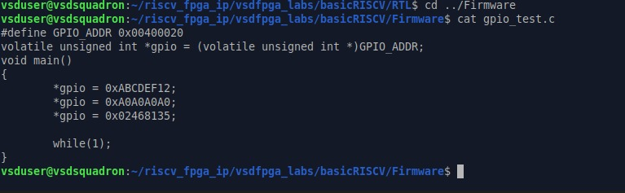

---

## Firmware Compilation

The firmware was compiled using the RISC-V cross-compilation toolchain.

The resulting executable was converted into a BRAM HEX file which is loaded into the SoC memory.

### BRAM HEX Generation

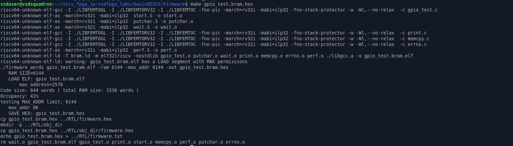

---

## Firmware Verification

The generated firmware image was successfully copied to the RTL directory.

This confirms that the simulation will execute the newly generated firmware instead of the default firmware.

### Firmware Build Status


### Firmware Verification

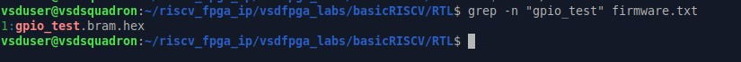

---

## Simulation Execution

Simulation was performed using Icarus Verilog.

### Commands Used

```bash
iverilog -DBENCH -o sim2.vvp riscv.v gpio_output.v ice40_stubs.v

vvp sim2.vvp

gtkwave sim2.vcd
```

### Purpose

- `iverilog` compiles the design.
- `vvp` executes the simulation.
- `gtkwave` visualizes signal activity.

### Simulation Log

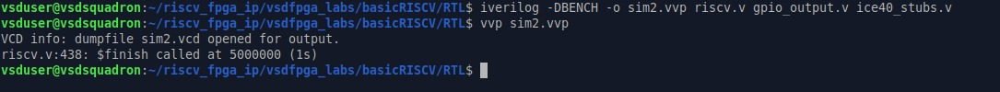

---

# GTKWave Verification

The generated waveform was analyzed using GTKWave.

The following signals were monitored:

- clk
- resetn
- gpio_sel
- mem_addr
- mem_wdata
- GPIO_OUT

### Observations

1. Clock signal is active.
2. Reset signal is released.
3. GPIO peripheral is selected through address decoding.
4. Data is written from the processor into the GPIO register.
5. GPIO output updates correctly.

### Final GPIO Value

```text
0x02468135
```

This value matches the last value written by the firmware, confirming successful operation.

### Waveform Screenshot

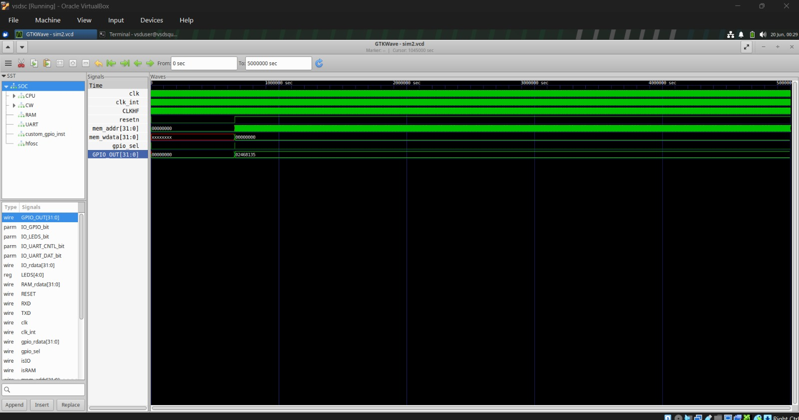

---

# Submission Requirements

## GPIO IP RTL File

The GPIO peripheral was implemented in:

```text
RTL/gpio_output.v
```

The RTL file contains:

- Register storage
- Write logic
- Readback logic
- Reset functionality

---

## SoC Integration Description

The GPIO peripheral was integrated into the SoC by:

1. Creating a dedicated GPIO RTL module.
2. Assigning a unique decode bit (`IO_GPIO_bit = 3`).
3. Generating a GPIO select signal using address decoding.
4. Instantiating the GPIO module in the SoC top level.
5. Connecting processor write data and control signals.
6. Integrating GPIO readback into the SoC read path.
7. Routing the GPIO output to the system output bus.

This integration enables the processor to communicate with the GPIO peripheral through memory-mapped I/O transactions.

---

## Simulation Proof

Simulation was successfully completed and verified using GTKWave.

Evidence provided in this report includes:

- Firmware compilation log
- BRAM HEX generation log
- Firmware loading verification
- Simulation execution log
- GTKWave waveform screenshot

These results confirm successful operation of the GPIO peripheral.

---

# Short Explanation

## Address Used

The GPIO peripheral was assigned the memory-mapped base address:

```text
0x00400020
```

This address belongs to the I/O address region of the SoC. Whenever the processor accesses this address, the GPIO peripheral is selected through the address decoding logic and responds to the operation.

---

## How CPU Accesses the GPIO IP

The processor accesses the GPIO peripheral through memory-mapped I/O.

From the software perspective, the GPIO register behaves like a normal memory location.

### Write Example

```c
*gpio = 0x02468135;
```

### Read Example

```c
value = *gpio;
```

The CPU performs the following sequence:

1. Places the GPIO address on the address bus.
2. Places data on the write data bus.
3. Activates the write enable signal.
4. Address decoding logic selects the GPIO peripheral.
5. The GPIO register stores the incoming value.
6. The GPIO output updates accordingly.

For read operations, the stored GPIO value is returned through the processor read data bus.

---

## What Was Validated in Simulation

The simulation verified the complete functionality of the GPIO peripheral.

The following features were successfully validated:

- Correct memory-mapped address decoding.
- Successful GPIO module instantiation.
- Proper write operation.
- Register storage behavior.
- GPIO output update.
- Readback path integration.
- Correct processor-to-peripheral communication.
- Successful execution of firmware-generated writes.

The final waveform showed the GPIO output reaching:

```text
0x02468135
```

which exactly matches the last value written by the firmware.

---

# Conclusion

A custom 32-bit GPIO peripheral was successfully designed, integrated, and verified within the RISC-V SoC environment. The peripheral correctly responded to memory-mapped accesses, stored processor-generated data, and reflected the expected output value during simulation. The successful waveform verification confirms correct RTL functionality, SoC integration, firmware interaction, and overall system operation.
</details>
<details>
<summary><b>Task 5: Design a Multi-Register GPIO IP with Software Control</b></summary>


## Overview

This project implements a **Multi-Register GPIO IP** integrated into a RISC-V SoC. The design extends the basic GPIO peripheral by introducing multiple memory-mapped registers for GPIO data, direction control, and readback functionality.

The GPIO IP enables software running on the RISC-V processor to configure GPIO pins as inputs or outputs, drive output values, and read current GPIO states through memory-mapped I/O.

The implementation was validated using firmware written in C and simulated using **Icarus Verilog (iverilog)** and **GTKWave**.

---

# Project Objectives

The objectives of this task were to:

- Design a realistic multi-register GPIO peripheral.
- Implement memory-mapped register access.
- Support GPIO direction configuration.
- Support GPIO output control.
- Support GPIO input readback.
- Integrate the GPIO IP into the SoC.
- Validate functionality through firmware and simulation.

---

# Repository Structure

```
TASK5/
│
├── README.md
├── gpio_control.v
├── riscv.v
├── gpio_test.c
├── io.h
├── gtk_task4.jpeg
├── 1_t5.jpeg
├── 2_t5.jpeg
├── ...
└── 13_t5.jpeg
```

---

# GPIO Register Map

| Offset | Register | Description |
|---------|----------|-------------|
| **0x00** | GPIO_DATA | Stores GPIO output values |
| **0x04** | GPIO_DIR | Controls GPIO direction (1 = Output, 0 = Input) |
| **0x08** | GPIO_READ | Returns current GPIO pin values |

This register map allows software to control the GPIO peripheral using standard memory-mapped I/O transactions.

---

# GPIO IP Architecture

The GPIO controller receives memory transactions from the CPU and updates internal registers based on the selected register address.

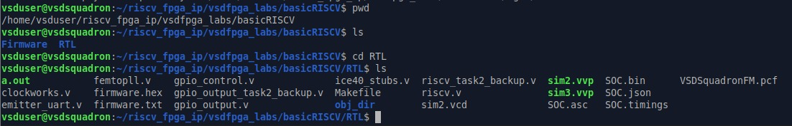

The GPIO module contains:

- GPIO Data Register
- GPIO Direction Register
- Readback Logic
- Address Decoder
- Register Selection Logic

---

# Internal Registers

The GPIO controller maintains two internal registers.

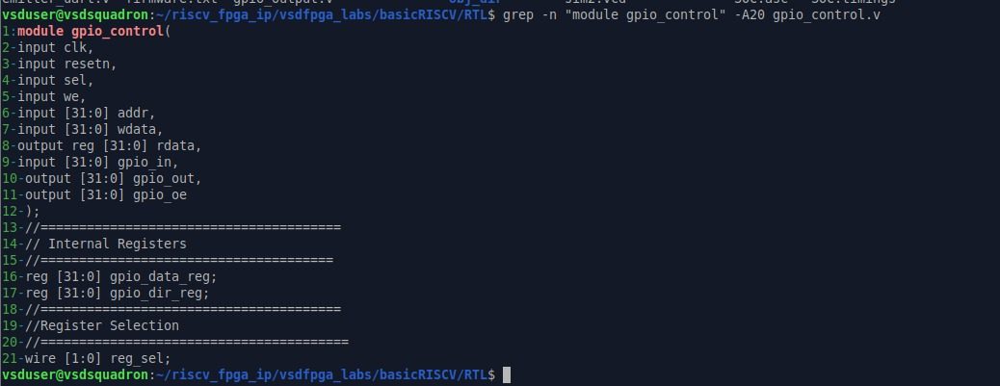

### GPIO Data Register

Stores the output value driven to GPIO pins.

```verilog
reg [31:0] gpio_data_reg;
```

### GPIO Direction Register

Controls whether each GPIO pin acts as an input or output.

```verilog
reg [31:0] gpio_dir_reg;
```

Each bit independently controls one GPIO pin.

---

# Register Selection

The GPIO controller decodes address bits to determine which register is being accessed.

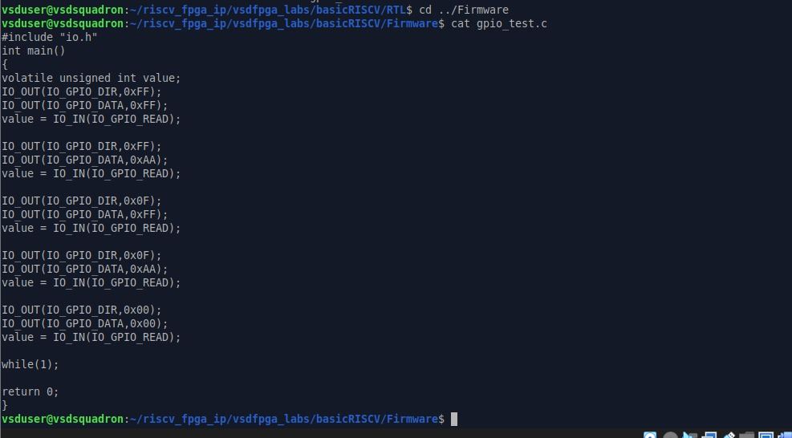

Register encoding:

| reg_sel | Register |
|----------|----------|
| 00 | GPIO_DATA |
| 01 | GPIO_DIR |
| 10 | GPIO_READ |

This minimizes hardware complexity while supporting multiple registers.

---

# Write Logic

Write operations occur only when both the peripheral select signal and write enable signal are asserted.

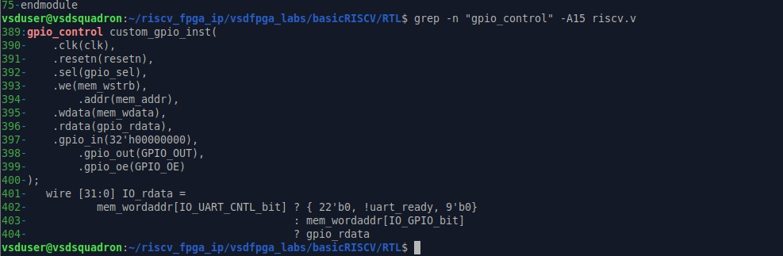

The write logic performs:

- Writing GPIO output values
- Writing GPIO direction values

```verilog
if(sel && we)
```

The case statement selects the appropriate register and updates its contents.

---

# Read Logic

Read operations return the contents of the selected register.

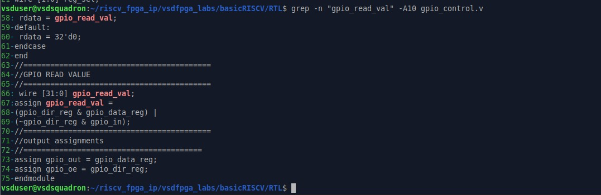

Depending on `reg_sel`, the module returns:

- GPIO_DATA
- GPIO_DIR
- GPIO_READ

This enables software to read back previously written values and current GPIO states.

---

# GPIO Readback Logic

The GPIO readback logic combines output and input values based on the configured direction.

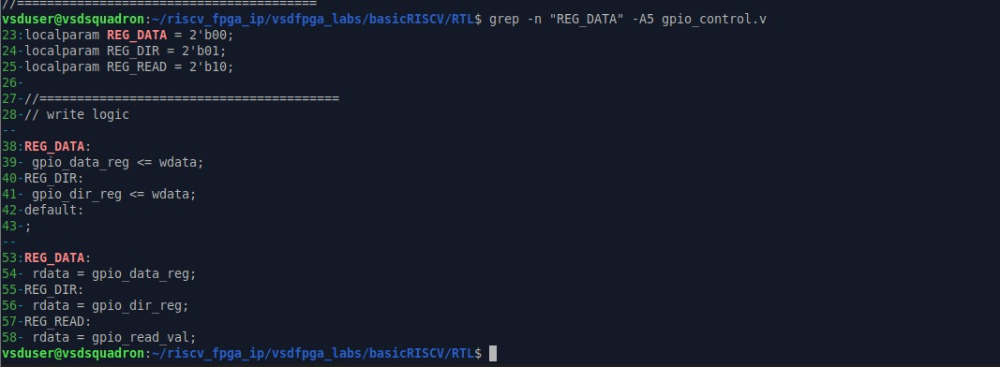

The implemented logic is:

```verilog
assign gpio_read_val =
    (gpio_dir_reg & gpio_data_reg) |
    (~gpio_dir_reg & gpio_in);
```

### Working

If a GPIO pin is configured as an **output**, the readback returns the value stored in `gpio_data_reg`.

If a GPIO pin is configured as an **input**, the readback returns the external GPIO input.

| Direction Bit | Mode | Read Value |
|---------------|------|------------|
| 1 | Output | GPIO_DATA |
| 0 | Input | GPIO_IN |

This behavior matches real-world GPIO peripherals.

---

# Output Assignments

The output signals are directly connected to the internal registers.

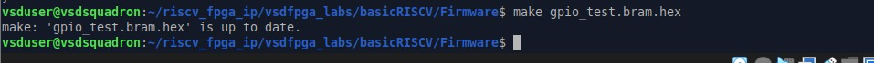

```verilog
assign gpio_out = gpio_data_reg;
assign gpio_oe  = gpio_dir_reg;
```

Where:

- `gpio_out` drives GPIO output values.
- `gpio_oe` enables output drivers according to the direction register.

---

# SoC Integration

The GPIO controller is instantiated inside the SoC and connected to the processor's memory interface.

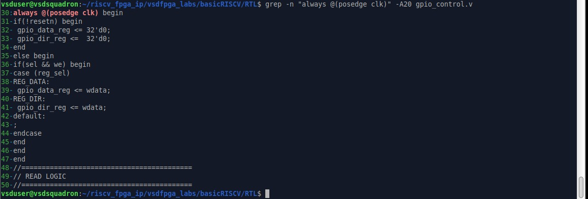

The CPU communicates with the GPIO controller using:

- Address bus
- Write data bus
- Read data bus
- Write enable
- Peripheral select

The GPIO peripheral behaves like any other memory-mapped device in the system.

---

# Firmware Validation

The functionality of the GPIO IP was verified using a C program.

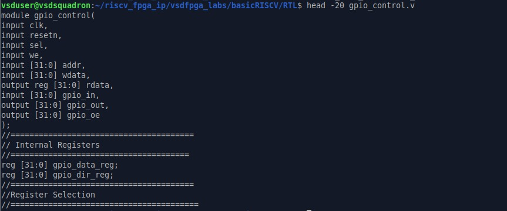

The firmware performs the following operations:

### Test 1

- Direction = 0xFF
- Data = 0xFF

Expected:

- All GPIO pins configured as outputs.
- Output value = 0xFF.

---

### Test 2

- Direction = 0xFF
- Data = 0xAA

Expected:

- Alternate GPIO bits driven HIGH.

---

### Test 3

- Direction = 0x0F
- Data = 0xFF

Expected:

- Lower four pins operate as outputs.
- Upper four pins operate as inputs.

---

### Test 4

- Direction = 0x0F
- Data = 0xAA

Expected:

- Mixed input/output operation.

---

### Test 5

- Direction = 0x00
- Data = 0x00

Expected:

- All GPIO pins operate as inputs.

---

# Firmware Compilation

The firmware was compiled into a BRAM image using the provided build system.

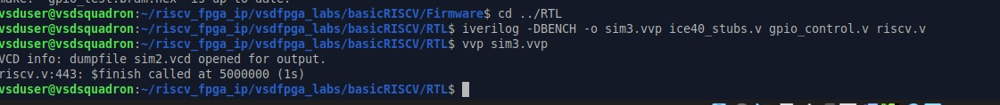

The generated firmware image was loaded into the SoC simulation for execution.

---

# RTL Simulation

The complete SoC was simulated using Icarus Verilog.

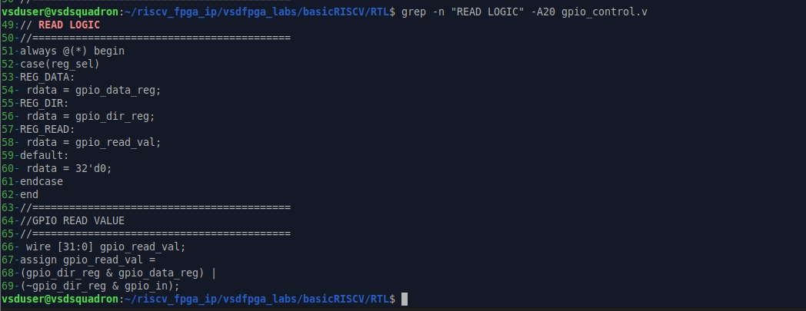

Simulation commands:

```bash
iverilog -DBENCH -o sim3.vvp ice40_stubs.v gpio_control.v riscv.v
vvp sim3.vvp
```

The simulation successfully generated the waveform file viewed in GTKWave.

---

# GTKWave Results

The generated waveform verifies correct GPIO operation.

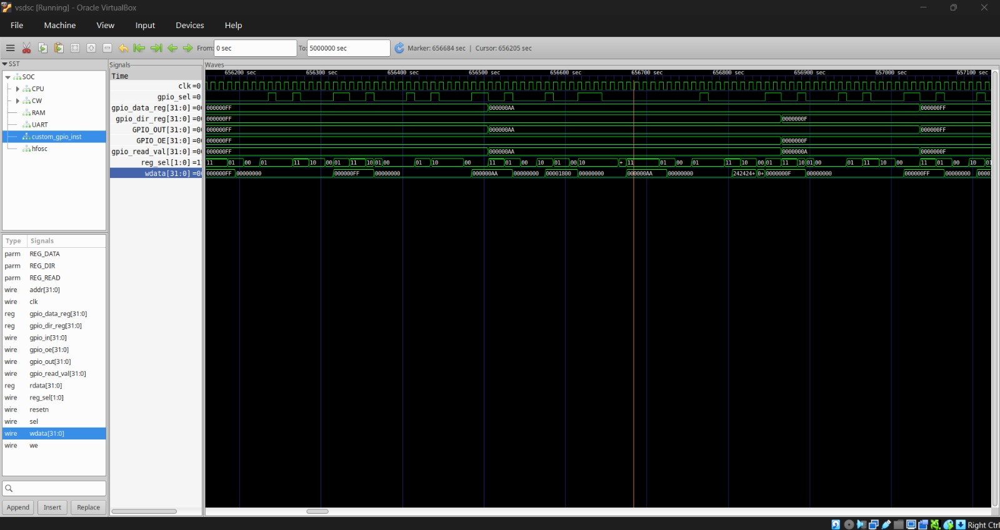

The waveform shows:

- Clock operation
- Register selection
- Write transactions
- GPIO data updates
- Direction register updates
- GPIO output enable changes
- GPIO readback values

The simulation confirms correct interaction between software and hardware.

---

# Address Offset Decoding

The GPIO peripheral occupies one base address in memory and internally decodes register offsets.

| Offset | Register |
|---------|----------|
| Base + 0x00 | GPIO_DATA |
| Base + 0x04 | GPIO_DIR |
| Base + 0x08 | GPIO_READ |

The lower address bits are decoded into the `reg_sel` signal.

```
reg_sel = addr[3:2]
```

This allows multiple registers to share a common peripheral base address while remaining individually accessible.

---

# Effect of Direction Register

The direction register determines whether a GPIO pin behaves as an input or an output.

| GPIO_DIR | Pin Mode | GPIO_READ Returns |
|----------|----------|------------------|
| 1 | Output | GPIO_DATA |
| 0 | Input | GPIO_IN |

When configured as an output:

- Output driver is enabled.
- GPIO_DATA is driven to the pin.

When configured as an input:

- Output driver is disabled.
- External GPIO value is read.

This behavior closely resembles the GPIO peripherals used in commercial microcontrollers and SoCs.

---

# Results

The implemented GPIO IP successfully demonstrates:

- Multi-register peripheral design
- Memory-mapped register interface
- GPIO direction control
- GPIO output control
- GPIO readback functionality
- Firmware-driven hardware control
- Successful RTL simulation

---
## Project Summary

This project focuses on enhancing a basic GPIO peripheral by transforming it into a more realistic **multi-register GPIO IP** that can be controlled entirely through software. Instead of using a single register, the design introduces separate memory-mapped registers for **GPIO Data**, **GPIO Direction**, and **GPIO Read**, allowing the processor to configure and access the peripheral efficiently. The GPIO IP is integrated into a RISC-V System-on-Chip (SoC), where the CPU communicates with it through memory-mapped I/O. A C firmware application is developed to write to and read from the GPIO registers, validating the functionality of the hardware design. The complete design is simulated using **Icarus Verilog**, and the generated waveforms are analyzed using **GTKWave** to verify correct register operations, address decoding, GPIO direction control, and readback behavior. This project demonstrates the complete interaction between software and hardware, providing practical experience in designing custom peripherals and integrating them into an embedded SoC environment.

## Key Learning Outcomes

Through this project, the following concepts were implemented and verified:

- Designed a **multi-register GPIO peripheral** with separate Data, Direction, and Read registers.
- Implemented **memory-mapped I/O**, allowing software to communicate with hardware using register addresses.
- Developed **address decoding logic** to select the appropriate GPIO register based on the accessed memory offset.
- Implemented **GPIO direction control**, enabling each GPIO pin to function as either an input or an output.
- Designed **GPIO readback logic** to correctly return either the output value or the external input value depending on the configured direction.
- Integrated the custom GPIO IP into the **RISC-V SoC** and connected it to the processor's memory interface.
- Wrote and executed **C firmware** to validate GPIO functionality through multiple test cases.
- Verified the complete design using **RTL simulation** with **Icarus Verilog** and analyzed signal behavior using **GTKWave**.
- Gained practical understanding of the complete **software → memory bus → GPIO IP → hardware signal** workflow used in modern embedded systems.
# Tools Used

- Verilog HDL
- RISC-V SoC
- Icarus Verilog
- GTKWave
- GCC (RISC-V Toolchain)
- VSDSquadron Environment

---

# Conclusion

This project successfully extends a basic GPIO peripheral into a realistic multi-register IP suitable for integration within a RISC-V SoC. The design supports configurable GPIO direction, output control, and readback through memory-mapped registers. Software running on the processor interacts seamlessly with the hardware using standard memory-mapped I/O, and the functionality has been verified through firmware execution and waveform analysis. The implementation demonstrates the complete software-to-hardware flow expected in modern embedded systems and provides a strong foundation for developing more advanced peripherals such as timers, PWM controllers, and interrupt-driven devices.
</details>

<details>
<summary><b>Task 6: Real Peripheral IP Development (Core Contributor Task)(WIP)
</b></summary>
# Task 6: Memory-Mapped PWM IP Integration for RISC-V SoC

## Overview

This project implements a **Single-Channel Pulse Width Modulation (PWM) IP** as a **memory-mapped peripheral** for the VSD RISC-V SoC. The PWM peripheral enables software running on the RISC-V processor to generate configurable PWM signals through dedicated memory-mapped registers. The project covers the complete design flow, including RTL implementation, SoC integration, firmware development, and functional verification using simulation.

The peripheral allows software to configure the PWM period, duty cycle, enable state, and output polarity without modifying the hardware, making it suitable for applications such as LED brightness control, motor speed control, servo interfacing, and other embedded control systems.

---

# Features

- Memory-mapped peripheral interface
- 32-bit register architecture
- Configurable PWM period
- Configurable duty cycle
- PWM enable/disable control
- Output polarity selection
- Status register for monitoring
- Integrated into the VSD RISC-V SoC
- Firmware configurable
- Functionally verified using GTKWave simulation

---

# PWM IP Specification

The PWM IP generates a pulse-width modulated digital output by comparing an internal counter with a programmable duty-cycle register. The processor controls the peripheral through memory-mapped registers, allowing the PWM waveform to be configured completely in software.

The peripheral contains four registers:

- CTRL
- PERIOD
- DUTY
- STATUS

Each register occupies one 32-bit word and is accessed through the processor's memory-mapped I/O interface.

---

# Register Map

**Peripheral Base Address :** `0x00400000`

| Offset | Register | Access | Description |
|---------|----------|--------|-------------|
| 0x40 | CTRL | R/W | PWM Enable and Output Polarity |
| 0x44 | PERIOD | R/W | PWM Period |
| 0x48 | DUTY | R/W | PWM Duty Cycle |
| 0x4C | STATUS | Read Only | Current PWM Status |

---

## Register Description

### CTRL Register (0x40)

The CTRL register controls the operating mode of the PWM peripheral.

| Bit | Function |
|-----|----------|
| Bit 0 | PWM Enable |
| Bit 1 | Output Polarity |
| 31:2 | Reserved |

- **Bit 0 = 1** enables PWM generation.
- **Bit 0 = 0** disables the PWM output.
- **Bit 1 = 0** generates an active-high PWM waveform.
- **Bit 1 = 1** generates an active-low PWM waveform.

---

### PERIOD Register (0x44)

This register stores the PWM period in clock cycles. The internal counter continuously counts from **0** to **PERIOD − 1** before restarting from zero.

Example:

```
PERIOD = 100

Counter:

0 → 1 → 2 → ... → 99 → 0
```

---

### DUTY Register (0x48)

The DUTY register determines how long the PWM output remains HIGH during one PWM period.

Example:

```
PERIOD = 100
DUTY   = 40
```

The output remains HIGH for the first **40 clock cycles** and LOW for the remaining **60 clock cycles**, producing a **40% duty cycle**.

---

### STATUS Register (0x4C)

The STATUS register provides runtime information about the PWM peripheral.

Currently,

- Bit 0 indicates whether PWM generation is enabled.
- Remaining bits are reserved for future extensions.

---

# RTL Implementation

The PWM controller is implemented in **Verilog HDL** (`RTL/pwm.v`). The design follows a synchronous architecture and communicates with the processor through the standard memory-mapped bus interface consisting of address, write data, read data, select, and write-enable signals.

The module internally consists of:

- Register Interface
- Register Write Logic
- Register Read Logic
- PWM Counter
- PWM Output Logic

---

## PWM Module

The following figure shows the top-level implementation of the PWM controller. The module exposes the processor interface along with the generated PWM output.

<p align="center">
    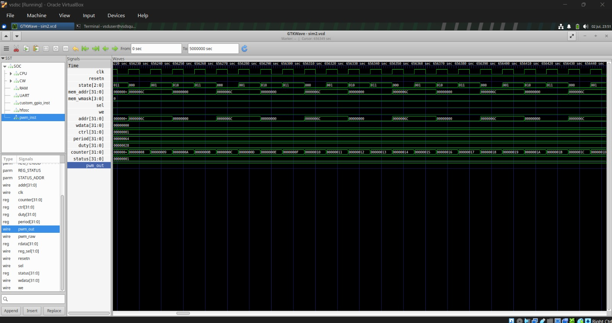
</p>

---

## Register Interface

Four memory-mapped registers are implemented inside the peripheral.

- CTRL Register
- PERIOD Register
- DUTY Register
- STATUS Register

Each register occupies one 32-bit word and is selected using the lower address bits.

<p align="center">
    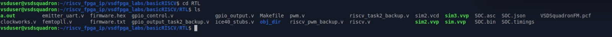
</p>

---

## Register Write Logic

Whenever the processor performs a valid write transaction (`sel && we`), the corresponding register is updated according to the selected register address.

The processor can modify:

- CTRL
- PERIOD
- DUTY

This enables software to dynamically configure the PWM peripheral during runtime.

<p align="center">
    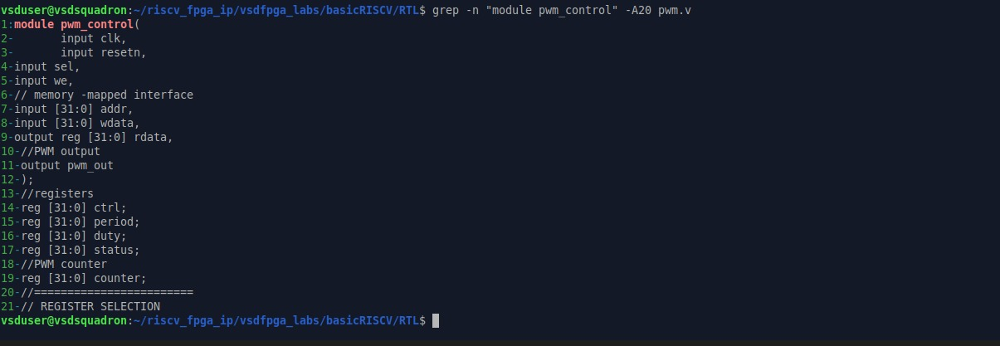
</p>

---

## Register Read Logic

The processor can also read the current contents of every register. The read logic selects the appropriate register based on the incoming address and returns the register contents on the read-data bus.

If an undefined register address is accessed, the peripheral returns zero.

<p align="center">
    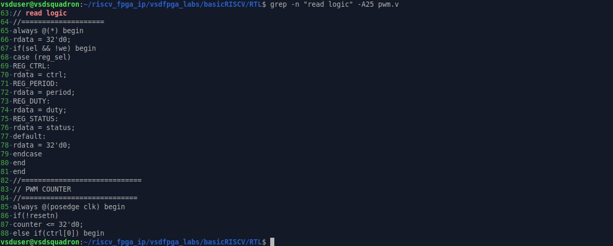
</p>

---

## PWM Counter

The PWM counter acts as the timing reference for waveform generation.

When PWM is enabled:

- Counter increments every clock cycle.
- Counter resets to zero after reaching **PERIOD − 1**.
- A new PWM cycle begins automatically.

<p align="center">
    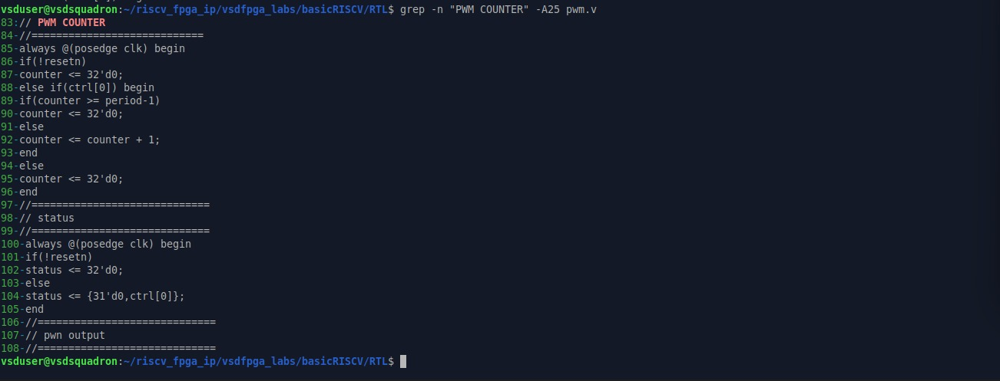
</p>

---

## PWM Output Generation

The PWM output is generated by continuously comparing the counter value with the programmed DUTY register.

The implemented logic is:

```verilog
pwm_raw = (counter < duty);
```

The CTRL register controls whether PWM is enabled and also determines the output polarity.

- Enable bit activates or disables PWM generation.
- Polarity bit selects active-high or active-low operation.
- Changing the PERIOD or DUTY register immediately affects the generated waveform.

<p align="center">
    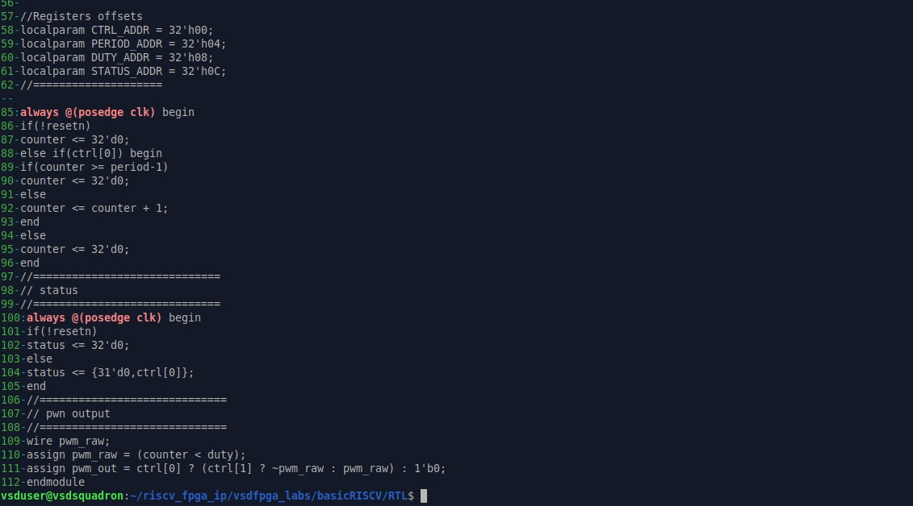
</p>

---

# SoC Integration

The PWM IP was integrated into the VSD RISC-V SoC as a new memory-mapped peripheral. The integration reuses the existing processor bus and follows the same communication protocol as the other peripherals already present in the system.

The integration required the following modifications:

- Added `pwm.v` to the RTL project.
- Allocated a dedicated memory-mapped address region.
- Added PWM address decoding.
- Connected processor address, write data, read data, select, and write-enable signals.
- Connected the generated PWM output to the SoC output.

---

## Address Decoding

A dedicated I/O word address bit (`IO_PWM_bit`) is assigned to the PWM peripheral. Whenever the processor accesses this address region, the PWM peripheral is selected and responds to the read or write transaction.

<p align="center">
    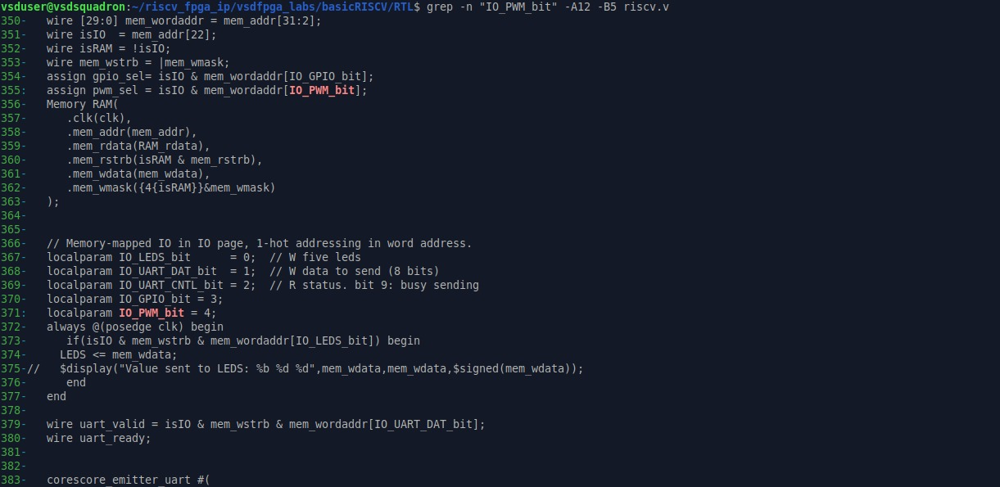
</p>

---

## PWM Module Instantiation

The PWM controller is instantiated inside the RISC-V SoC and connected directly to the processor bus. The processor communicates with the peripheral using the existing memory-mapped interface, requiring no changes to the processor instruction set.

<p align="center">
    
</p>

---

## Read Data Multiplexer

The PWM peripheral is connected to the shared I/O read-data multiplexer. During read operations, the selected PWM register value is returned to the processor through the common peripheral read path.

<p align="center">
    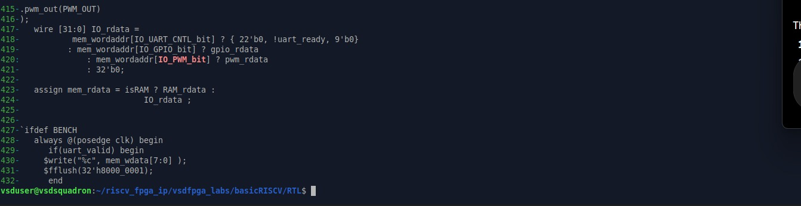
</p>
---

# Firmware Validation

To verify the functionality of the PWM peripheral, a simple firmware application was developed. The firmware configures the PWM registers through the memory-mapped interface, demonstrating successful communication between software and the hardware peripheral.

The firmware performs the following operations:

- Configures the PWM period.
- Sets the duty cycle.
- Enables PWM output.
- Continuously runs while the PWM hardware generates the waveform independently.

---

## Register Definitions

The PWM register offsets are defined inside `Firmware/io.h`. These definitions provide symbolic names for the memory-mapped registers, making the firmware easier to understand and maintain.

The following registers were added:

- `IO_PWM_CTRL`
- `IO_PWM_PERIOD`
- `IO_PWM_DUTY`
- `IO_PWM_STATUS`

<p align="center">
    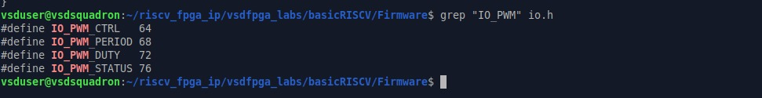
</p>

---

## PWM Test Program

The firmware configures the PWM IP using memory-mapped writes.

```c
IO_OUT(IO_PWM_PERIOD,100);
IO_OUT(IO_PWM_DUTY,40);
IO_OUT(IO_PWM_CTRL,1);
```

The above configuration sets:

- **PWM Period = 100 clock cycles**
- **Duty Cycle = 40 clock cycles**
- **PWM Enabled**

Once configured, the processor enters an infinite loop while the PWM peripheral continues generating the waveform.

<p align="center">
    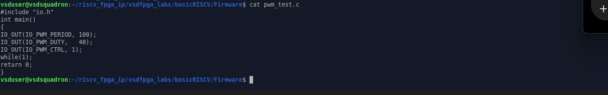
</p>

---

# SoC Integration Verification

After integrating the PWM peripheral into the SoC, the address decoder and read-data path were updated to connect the new peripheral with the processor bus.

### Address Decoder

The PWM peripheral is selected using a dedicated address decode signal (`IO_PWM_bit`). Whenever the processor accesses the assigned memory region, the PWM peripheral is enabled for read or write operations.

<p align="center">
    
</p>

---

### Read Data Multiplexer

The PWM read data is connected to the SoC read-data multiplexer (`IO_rdata`). This allows software to read back the values stored in the PWM registers exactly like any other memory-mapped peripheral.

<p align="center">
    
</p>

---

# Simulation and Verification

The complete SoC, including the newly integrated PWM peripheral, was compiled and simulated using **Icarus Verilog**. Simulation verified that the processor successfully configured the PWM peripheral through the memory-mapped interface.

The following commands were used during simulation:

```bash
iverilog -DBENCH -o sim.vvp ice40_stubs.v gpio_control.v riscv.v

vvp sim.vvp

gtkwave sim2.vcd
```

The compilation completed successfully without any errors.

<p align="center">
    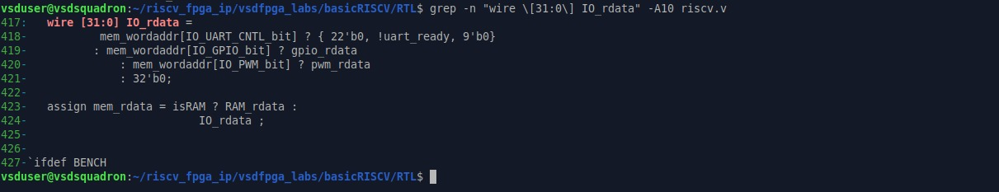
</p>

---

# Waveform Analysis

The generated waveform was analyzed using **GTKWave** to verify the behavior of the PWM peripheral.

The waveform confirms that:

- The processor successfully writes to the PWM registers.
- The CTRL register enables the PWM peripheral.
- The PERIOD register is programmed with **100**.
- The DUTY register is programmed with **40**.
- The internal counter increments correctly after enabling the peripheral.
- The STATUS register reflects the enabled state.
- The PWM output follows the configured duty cycle and period.

These observations confirm successful end-to-end hardware and software integration.

<p align="center">
    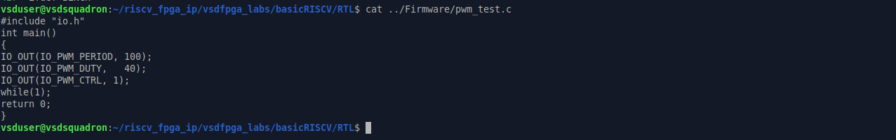
</p>

---
## Hardware Implementation and Validation

After successful synthesis, the generated bitstream (`SOC.bin`) was programmed onto the VSDSquadron FM FPGA board using the `iceprog` utility.

Programming was completed successfully with the following verification messages:

- `VERIFY OK`
- `cdone: high`

These messages confirm that the FPGA was successfully configured with the synthesized PWM IP integrated into the RISC-V SoC.

### FPGA Programming

<p align="center">
  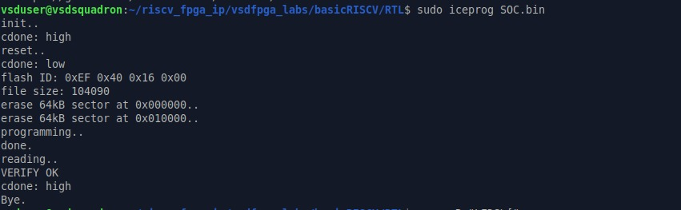
</p>

*Figure: Successful programming of the FPGA showing `VERIFY OK` and `cdone: high`.*

### Hardware Setup

The synthesized design was deployed onto the VSDSquadron FM FPGA board through the onboard USB programming interface. The board powered up successfully after programming, confirming successful hardware implementation of the integrated design.

<p align="center">
  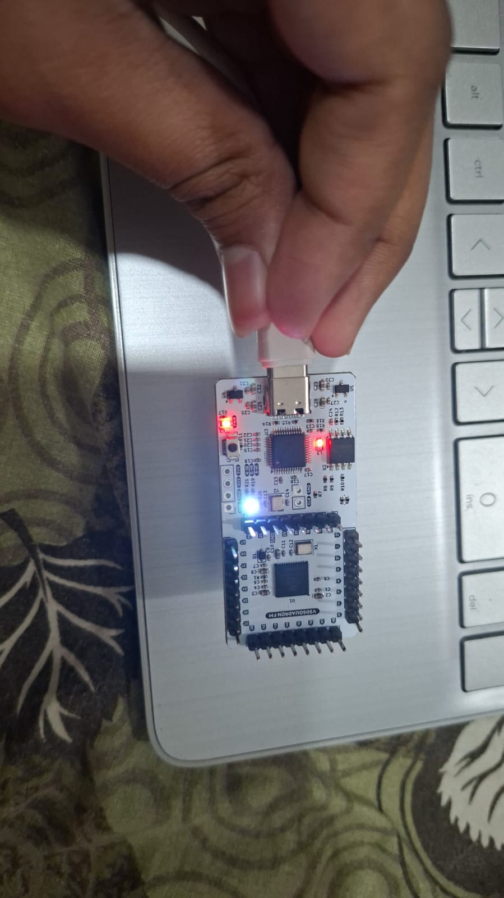
</p>

*Figure: VSDSquadron FM FPGA board after successful programming.*

### Hardware Validation

The hardware implementation was validated by successfully programming the FPGA with the generated bitstream. The programming log confirmed successful configuration (`VERIFY OK`), and the FPGA entered the configured state (`cdone: high`). This demonstrates successful deployment of the custom PWM IP integrated into the RISC-V SoC on the target FPGA hardware.

# Conclusion

A configurable **memory-mapped PWM IP** was successfully designed, integrated, and validated within the VSD RISC-V SoC. The processor configures the peripheral entirely through software by writing to dedicated memory-mapped registers, while the hardware generates the corresponding PWM waveform.

Simulation results confirm correct register operation, counter functionality, processor-peripheral communication, and PWM waveform generation, demonstrating successful completion of the complete RTL design, SoC integration, firmware development, and functional verification flow.
